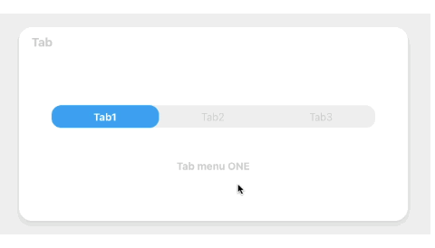
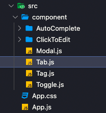

## Tab 만들기 🛠

웹서비스를 만들때 자주 사용하게 되는 Tab(네비게이션?)을 만들어 보자!! 프로젝트 구조는 다음과 같습니다. Tab 컴포넌트를 App.js에 불러와서 사용

<br />



<br />

### 1. Component 구조잡기 .

```jsx
Tab.js

const menuArr = [
    { name: "Tab1", content: "Tab menu ONE" },
    { name: "Tab2", content: "Tab menu TWO" },
    { name: "Tab3", content: "Tab menu THREE" },
  ];

  const [currentTab, setCurrentTab] = useState(0);

  const selectMenuHandler = (index) => {
    setCurrentTab(index);
  };

<TabBox>
  <TabMenu>
    {menuArr.map((el, index) => {
     return (
        <li
        key={index}
          className={`${
            index === currentTab ? "submenu focused" : "submenu"
          }`}
          onClick={() => selectMenuHandler(index)}
        >
          {el.name}
        </li>
      );
    })}
  </TabMenu>
  <Desc>
     <p>{menuArr[currentTab].content}</p>
  </Desc>
</TabBox>

```

### 2. Component 스타일링 .

```css
Tab.js

const TabBox = styled.div`
  width: 100%;
  height: auto;
  padding: 0 50px;
`;

const TabMenu = styled.ul`
  background-color: #efefef;
  color: #ccc;
  display: flex;
  flex-direction: row;
  justify-items: center;
  align-items: center;
  list-style: none;
  height: 35px;
  border-radius: 15px;
  overflow: hidden;
  padding: 0;
  margin-bottom: 50px;

  .submenu {
    display: flex;
    justify-content: center;
    flex-grow: 1;
    cursor: pointer;
  }

  .focused {
    background-color: #1da1f2;
    color: white;
    font-weight: bold;
    height: 100%;
    display: flex;
    align-items: center;
    border-radius: 15px;
    transition: 0.25s;
  }
`;

const Desc = styled.div`
  text-align: center;
  color: #ccc;
  font-weight: bold;
`;
```

<br />


### 구현 방법 .

> li 엘리먼트를 map 함수로 menu의 숫자만큼 만들어 준 뒤, 인덱스를 두 번째 인자로 넣어서 onClick 핸들러 함수에 index를 전달했습니다. 그리고 인덱스를 전달받은 함수를 통해서 currentTab 상태를 해당 인덱스로 바꿔주며클릭 된 Tab의 className을 변경하고 클릭 된 메뉴의 CSS 값을 변경, 선택된 li이 엘리먼트를 시각화 시켜줄 수 있게 됩니다.

<br />

### 어려웠던 점 해결 방법 .

> 처음 구현할 시 menu를 map 함수로 생성한 것이 아니라 li를 원하는 menu 개수만큼 만들어 구현하였습니다. 코드의 길이가 길어지고 효율성이 떨어진다 판단하여 map 함수를 사용하여 menu를 원하는 개수만큼 생성하였고 인덱스를 두 번째 인자로 넣어서 onClick 핸들러 함수에 index를 전달해서 해결하였습니다.

```jsx
<TabMenu>
  {menuArr.map((el, index) => {
    return (
      <li
        key={index}
        className={`${
          index === currentTab ? "submenu focused" : "submenu"
        }`}
        onClick={() => selectMenuHandler(index)}
      >
        {el.name}
      </li>
    );
  })}
</TabMenu>
```

<br />

### 자세한 실행 방법 .

> 1. li 엘리먼트를 map 함수로 menu의 개수만큼 만들었습니다.<br />
> 2. 인덱스를 두 번째 인자로 넣어서 onClick 핸들러 함수에 index를 전달합니다.<br />
> 3. 인덱스를 전달받은 함수를 통해서 currentTab 상태를 해당 인덱스로 바꿔주면서 클릭된 Tab의 className을 바꿔주므로 인해서 클릭 된 메뉴의 CSS 속성만 바꿔 선택되었음을 시각화 시켜줄 수 있게 하였습니다.

<br />
<br />