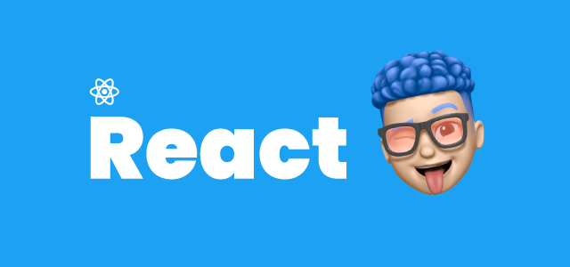

## ✨ Hook이란?

- 함수 컴포넌트에서 React state와 Lifecycle 기능을 연동할 수 있게 해주는 함수 (버전 16.8부터 도입)
- 만들어진 목적 자체가 함수 컴포넌트에서 사용하기 위함이었으니 당연히 클래스 컴포넌트 안에서는 동작하지 않음
- 기존에 함수 컴포넌트를 사용하다가 state를 추가하고 싶어서 클래스 컴포넌트로 바꾸곤 했는데 이제 그럴 필요가 없다!

<br />

## ⚙️ Hook의 사용 규칙 
1 .최상위에서만 Hook 호출이 가능 (루프, 조건문, 중첩된 함수 안에서는 사용할 수 없음) : 조건문을 Hook 내부에 넣는 것은 괜찮음

> 👉 &nbsp; 컴포넌트가 렌더링 될 때마다 항상 동일한 순서로 Hook이 호출되는 것이 보장되어 state를 올바르게 유지할 수 있음

2️. 리액트 함수 컴포넌트 내에서만 호출이 가능하며, 일반 자바스크립트 함수 안에서는 호출하면 안됨 (custom hook에서는 가능)

<br />

## 🛠 왜 Hook을 만들었을까? 

컴포넌트들 사이에서 상태 로직을 재사용하는 것의 어려움

> - higher-order component는 코드 추적이 어렵고 ‘wrapper hell’
> - Hook은 컴포넌트의 계층을 바꾸지 않고 상태 로직을 재사용할 수 있음

복잡한 컴포넌트는 이해하기 어려움

> - 여러 Lifecycle 메소드들이 관련 없는 로직들과 섞여 있음 
> - 그래서 버그가 자주 발생하고 무결성 유지가 어려움

 Class 컴포넌트는 인간과 기계 모두를 혼란스럽게 함
> - 리액트의 진입장벽
> - 코드가 장황해짐
> - Class 없이 React 기능을 사용해보자! -> Hook

<br />

## 🤔 드디어 useState란?

리액트 16.8이전 버전에서는 함수형 컴포넌트에서는 상태관리를 할 수 없었지만 리액트 16.8에서 Hooks라는 기능이 도입되면서 함수형 컴포넌트에서도 상태를 관리할 수 있게 되었다.

> useState는 값이 변하는지 변하지 않는지 상태를 관리를 한다.<br />그래서 초기값을 줄 수 있는데 초기값을 통해서 특정 값을 정의해주는 함수를 만들어 줄 수 있다.

<br />

Hook을 호출하여 함수 컴포넌트에 state 변수를 선언할 수 있는 함수 -> 컴포넌트가 다시 렌더링되어도 그대로 유지됨
기존 class 컴포넌트에서 사용하던 this.state와 동일한 역할을 한다. useState는 state 변수와 state를 업데이트 하는 함수, 두 가지 쌍을 반환한다.

<br />

```jsx
const [age, setAge] = useState(42);
const [fruit, setFruit] = useState('banana');
const [todos, setTodos] = useState([{ text: 'Learn Hooks' }]);
```

<br />

이런 식으로 state들을 여러 개 선언할 수 있다. 위와 같은 표현은 구조 분해 할당이라고 한다. 첫 번째 인자는 state의 name이고 두 번째 인자는 state를 업데이트할 수 있는 함수이다. useState에 전달하는 인자는 state의 initial value의 값이다. 객체로 넘겨주어도 된고 숫자나 문자 타입도 가능하다.

<br />
<br />