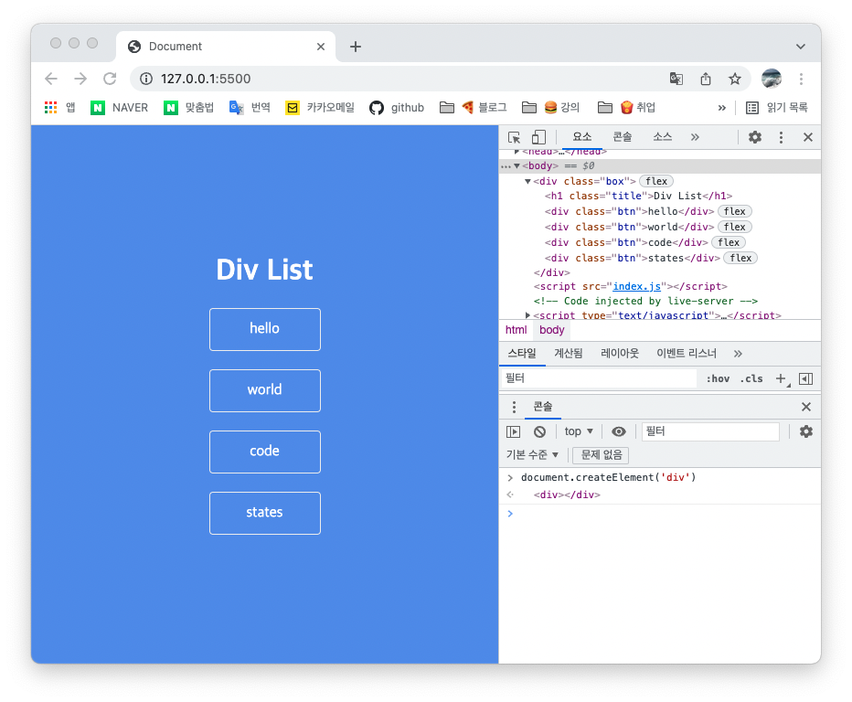

## DOM

DOM은 Document Object Model의 약자이며, HTML 요소를 Object(JavaScript Object)처럼 조작(Manipulation)할 수 있는 Model이다.

[MDN](https://developer.mozilla.org/ko/docs/Web/API/Document_Object_Model/Introduction) 에서 말하는 DOM의 정의는 다음과 같다.

> 문서 객체 모델(The Document Object Model, DOM) 은 HTML, XML 문서의 프로그래밍 interface이다.

여기서 XML이란 EXtensible Markup Language의 약자이다. 간단하게 설명하면, 텍스트 기반 컴퓨터 자료 구조인 SGML을 HTML처럼 간략화, 표준화하면서 HTML과 호환될 수 있도록 만들어진 마크업 언어이다.

다시 돌아와서, DOM이란 마크업 언어를 구조화해 웹페이지를 프로그래밍 언어를 통해 변경할 수 있게 하는 API인 셈이다.

<br />

## DOM으로 HTML 조작하기

HTML 엘리먼트를 만들고(CREATE), 조회하고(READ), 갱신하고(UPDATE), 삭제하는(DELETE) 하는 방법을 학습해보자

간단한 div리스트를 만든 뒤 구글크롬 개발자 도구로 진행, 아래 코드를 만들어 둔 div리스트 콘솔탭에 작성하여 div를 생성

```jsx
document.createElement('div')
```



<br />

만들어진 `div`element는 testDiv에 할당하여 활용

```jsx
const testDiv = document.createElement('div')
```

<br />


<br />

아직 화면에 변화가 없다. `testDiv`라는 요소는 현재 공중부양 중이다. 아래 그림은 DOM의 구조를 나타내는 트리 구조이다. 좌측 하단의 흰색 배경의 div는 createElement 메소드로 생성된 엘리먼트로 공중에 떠있는 상태이다.


위 그림처럼 공중에 떠있는 엘리먼트를 확인하기 위해서는 APPEND 해야한다. APPEND 를 이용해 실제 웹 페이지 상에도 보이는 것을 확인할 수 있다.

```jsx
document.body.append(testDiv)
```


생성한 testtDiv 를 box에 넣기 위해서는, box를 먼저 찾아야 한다.

자바스크립트에서 원시 자료형인 변수의 값을 조회하기 위해서는, 변수의 이름으로 직접 조회할 수 있다. 참조 자료형인 배열은 index를, 객체는 key를 이용해 값을 조회할 수 있다. 그러나 DOM은 조금 특별한 방법을 사용해야 한다. DOM으로 HTML 엘리먼트의 정보를 조회하기 위해서는 querySelector의 첫 번째 인자로 셀렉터(Selector)를 전달하여 확인할 수 있다. 셀렉터로는 HTML 태그("div"), id("#tweetList"), class(.tweet) 세 가지가 가장 많이 사용됨

> 참고로 querySelector는 셀렉터를 조회한다는 의미를 가지고 있다. query의 의미가 "질문하다"라는 것을 알고 있다면 역할을 쉽게 유추하실 수 있다. 이 query라는 단어는 개발자 간에 "ㅇㅇㅇ를 조회한다"라는 의미를 "쿼리를 날리다"라는 jargon(특정 영역에서만 사용되는 단어)로 굳어졌기 때문에 알고 있어야 한다.

querySelector 에 '.btn' 을 첫 번째 인자로 넣으면, 클래스 이름이 btn 인 HTML 엘리먼트 중 첫 번째 엘리먼트를 조회할 수 있다.

```jsx
const oneBtn = document.querySelector('.btn')
```

HTML 문서에는 클래스 이름이 tweet 인 엘리먼트가 여러 개 있는 데, 변수 oneTweet 에 할당된 엘리먼트는 단 하나입니다. 여러 개의 엘리먼트를 한 번에 가져오기 위해서는, querySelectorAll 을 사용한다. 이렇게 조회한 HTML 엘리먼트들은 배열처럼 for문을 사용하실 수 있다. 주의! 앞서 조회한 HTML 엘리먼트들은 배열이 아니다! 이런 '배열 아닌 배열'을 유사 배열, 배열형 객체 등 다양한 이름으로 부른다. 정식 명칭은 Array-like Object! Array-like Object 같이 개념을 설명하는 용어는 영어로도 명확하게 기억해두는 게 좋다.

```jsx
const tweets = document.querySelectorAll('.btn')
```

querySelector와 querySelectorAll 만 알아도 대부분의 엘리먼트를 조회할 수 있다.

```jsx
const getOneBtn = document.getElementById('box')
const queryOneBtn = document.querySelector('#box')
console.log(getOneBtn === queryOneBtn) // true
```

CREATE에서 생성한 div 엘리먼트를 box에 넣을 준비 끝, 다음 코드를 입력하면, box의 맨 마지막 자식 엘리먼트로 testDiv를 추가한다.

```jsx
const box = document.querySelector('#box')
const testDiv = document.createElement('div')
box.append(testDiv)
```


id가 box인 엘리먼트의 마지막 자식 요소로 testtDiv를 추가!!

<br />

div 엘리먼트에 class를 추가
```jsx
const oneBtn = document.createElement('div')

oneBtn.textContent = 'dev'

oneBtn.classList.add('btn')
```

생성한 엘리먼트에 텍스트를 채웠고, 클래스를 추가하여 스타일링을 적용, 이번에는 append를 이용해 box의 자식 요소로 추가

```jsx
box.append(oneBtn)
```


새롭게 추가한 엘리먼트는 클래스 btn의 스타일이 적용된 상태로 출력

### 이제 추가된 엘리먼트를 삭제해보기!!

```jsx
const box = document.querySelector('#box')
const testDiv = document.createElement('div')
box.append(testDiv)
testDiv.remove() // 이렇게 append 했던 엘리먼트를 삭제할 수 있다.
```

<br />


id가 box인 엘리먼트 아래에 testtDiv를 추가하고, remove로 삭제

```jsx
document.querySelector('#box').innerHTML = '';
```
innerHTML 을 이용하는 방법은 분명 간편하고 편리한 방식이지만, innerHTML은 보안에서 몇 가지 문제를 가지고 있다. 이 방법을 대신할 다른 메소드를 사용

`removeChild` 는 자식 엘리먼트를 지정해서 삭제하는 메소드, 모든 자식 엘리먼트를 삭제하기 위해, 반복문(while, for, etc.)을 활용할 수 있다. 다음의 코드는 자식 엘리먼트가 남아있지 않을 때까지, 첫 번째 자식 엘리먼트를 삭제 코드

```jsx
const box = document.querySelector('#box');
while (box.firstChild) {
  box.removeChild(box.firstChild);
}
```


box의 첫 번째 자식 엘리먼트가 존재하면, 첫 번째 자식 엘리먼트를 제거

removeChild 와 while 을 이용해 자식 요소를 삭제하면, 제목에 해당하는 H1 "Div List"까지 삭제된다. 이를 방지하기 위한 방법은 여러 가지가 있다. 자식 요소가 담고 있는 문자열을 비교해 "Div List"만 남기거나, 새로운 변수를 생성하고 Div List를 할당해뒀다가 반복문이 끝난 뒤에 새롭게 추가할 수도 있다. 또는 자식 엘리먼트를 하나만 남기게 할 수도 있다.

```jsx
const box = document.querySelector('#box');
while (box.children.length > 1) {
  box.removeChild(box.lastChild);
}
```

또는 직접 클래스 이름이 btn인 엘리먼트만 찾아서 지우는 방법도 있다.

```jsx
const btns = document.querySelectorAll('.btn')
btns.forEach(function(btn){
    btn.remove();
})
// or
for (let btns of btns){
    btns.remove()
}
```


<br />
<br />