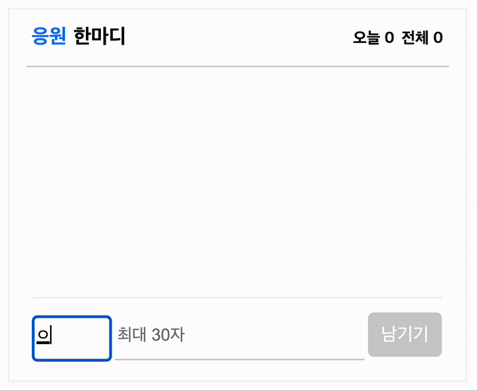
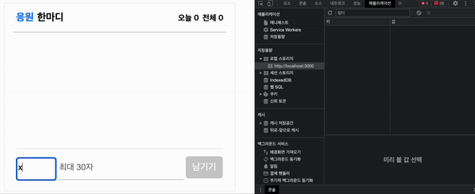
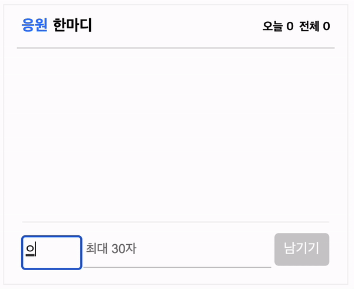

## 로컬 스토리지를 활용해 간다한 댓글 남기기

구현할 기능은 간단한 댓글 남기기이다. 프로젝트 스코프가 작다고 판단하여 팀원들과 회의 끝에 Redux를 사용하지않고 진행하기로 함. 로컬스토리지를 사용하여 구현하기로 마음먹었다

<br />



<br />

### view 작업을 진행하며 구현 사항을 체크했다.

1. 로컬 스토리지에 닉네임, 댓글 담고 남기기 버튼 클릭 시 댓글 보여주기
2. 우측 상단 추가된 댓글 만큼 숫자 count 하기
3. 우측에서 좌측으로 들어오는 에니메이션 추가
4. 새로 추가된 댓글에 스크롤이 고정되어 추가된 댓글 먼저 보여주기

<br />

### 1. 로컬 스토리지에 닉네임, 댓글 저장

```jsx
// 인풋값 상태 관리
  const nickName = useRef(null);
  const comment = useRef(null);

  // 로컬에 저장된 값 상태관리
  const [commentList, setCommentList] = useState([]);

  // 로컬에 입풋값 저장
  const saveComment = () => {
    const commentArry = [
      // 로컬에 배열 추가 스프레드 문법
      ...commentList,
      {
        // JSON 형태로 저장했기 때문에 JavaScript로 변경
        yourName: nickName.current.value,
        yourComment: comment.current.value,
      },
    ];
    // 로컬에 저장
    window.localStorage.setItem('saveComment', JSON.stringify(commentArry));
  };
  // 저장 버튼
  const inputHandler = () => {
    saveComment();
    // 로컬에 저장된 값 - setCommentList에 저장해둔 값을 get으로 가져오기
    setCommentList(JSON.parse(window.localStorage.getItem('saveComment')));
  };

  return (
    <>
      <MSGBox>
        {commentList.map((el, idx) => (
          <MSG key={idx}>
            <Left>
              <NickName>{el.yourName}</NickName>
              <FontAwesomeIcon icon={faCircle} className="icon" />
            </Left>
            <Right>
              <Message>{el.yourComment}</Message>
            </Right>
          </MSG>
        ))}
      </MSGBox>
      <InputBox>
        <NickNameInput placeholder="닉네임" ref={nickName} />
        <MessageInput placeholder="최대 30자" ref={comment} />
        <MSGButton onClick={inputHandler}>남기기</MSGButton>
      </InputBox>
    </>
  );
};
```

우선 유저가 작성하는 input의 닉네임과 댓글을 useRef를 사용하여 값을 받은 뒤, saveComment 함수인에서 commentArry 배열에 yourName, 과 yourCommet에 담아 로컬 스토리지에 setItem을 사용하여 저장한다. 댓글이 추가될 때마다 로컬 스토리지에 배열로 추가 저장하기 위해 스프레드 문법을 사용하여 ... commentList를 추가한다.

다음은 inputHandler를 사용하여 남기기 버튼을 클릭 시 로컬에 저장된 saveComment를 가져오며 map 함수를 사용하여 commentList의 yourName과 yourComment를 필요한 곳에 사용하였다.

<br />



<br />

## 2. 우측 상단 추가된 댓글 만큼 숫자 count 하기

숫자를 카운트할 부분이 부모 컴포넌트에 위치해있다. 그래서 useState를 사용하여 관리한 commentList를 부모 컴포넌트로 옮기고 props를 사용하여 값을 넘겨주었다.`{commentList.length}` commentList의 length 값을 오늘과 전체 텍스트 옆에 사용하여 추가된 댓글만큼 숫자를 카운트함

## 3. 우측에서 좌측으로 들어오는 에니메이션 추가

키 프레임을 활용하여 애니메이션을 구현하였고 opacity 값을 0에서 1로 margin-left 값을 20px에서 0px로 줄어들게 하여 댓글 작성 시 우측에서 좌측으로 들어오는 애니메이션을 구현했다.

```css
animation: fadeInMSG 0.85s cubic-bezier(0.22, 0.61, 0.36, 1);

@keyframes fadeInMSG {
  from {
    opacity: 0;
    margin-left: 20px;
  }
  to {
    opacity: 1;
    margin-left: 0;
  }
}
```

한 가지 아쉬운 점은 댓글을 감싸고 있는 부모 컴포넌트에 overflow: visble을 사용하여 잘리는 부분 없이 자연스럽게 들어오게 구현하고 싶었는데 댓글이 많아지니 부모 요소의 높이 값을 벗어나 ui를 망치게 되어 overflow: scroll을 사용할 수밖에 없었다. 이 부분을 좀 더 생각해 보고 원하는 대로 수정해 봐야겠다.

<br />

## 4. 새로 추가된 댓글에 스크롤이 고정되어 추가된 댓글 먼저 보여주기

댓글을 구현하고 테스트하기 위해 여러 개의 댓글을 추가하였는데 댓글 컴포넌트의 스크롤이 최 상단에 유지되어 작성한 순서대로 보이게 되었다 그래서 추가된 댓글을 보려면 스크롤을 내려야 하는 부분이 불편하다 유저에 불편함을 줄 수 있을 거라 생각하여 useRef와 useEffect를 사용하여 추가된 댓글에 포커스가 고정되도록 하였다.

```jsx
const commentScroll = useRef();

// 댓글 추가 시 스크롤 위치 하단 고정
const scrollToBottom = () => {
  if (commentScroll.current) {
    commentScroll.current.scrollTop = commentScroll.current.scrollHeight;
  }
};
useEffect(() => {
  scrollToBottom();
}, [commentList.length]);

<MSGBox ref={commentScroll}>
```

<br />

## + 댓글 등록 후 input값 초기화

뒤늦게 찾은 문제다.. 댓글을 등록 후 input에 작성한 내용이 그대로 남아있다. 댓글 등록 버튼을 클릭 시 useRef 값을 비워주는 코드를 추가하여 문제를 해결하였다.

<br />

```jsx
// 저장 버튼
const inputHandler = () => {
  saveComment();
  // 로컬에 저장된 값 - setCommentList에 저장해둔 값을 get으로 가져오기
  setCommentList(JSON.parse(window.localStorage.getItem('saveComment')));

  // 초기화
  nickName.current.value = '';
  comment.current.value = '';
};
```

<br />



<br />

### 회고 -

처음 유저가 input에 입력한 닉네임과 댓글을 useRef가 아닌 useState로 관리하여 진행했다. console.log로 input에 담긴 값들을 확인하다가 useState를 사용할 경우 글을 입력할 때마다 재랜더링 된다는 사실을 팀원의 조언으로 알게 되었다. 그래서 useRef를 사용하게 된 건데 참 유용한 정보였던 거 같다. 이 부분을 잘 기억하고 다음 프로젝트에서도 알맞게 사용해야겠다. + input값 초기화도 잊지말고 ㅋㅋ

팀원들과 프로젝트를 진행 전 상태 관리를 따로 안 해도 구현이 가능할 거 같다는 의견이 모아졌다. 주어진 시간은 짧고 조건은 많았기 때문에 상태 관리 없이 전역으로 관리하여 프로젝트를 진행하고자 한 것이다. 다들 공감하였고 진행했지만 프로젝트가 끝날 쯤 팀원 모두 다음 프로젝트에는 Redux를 사용하자는 의견이 다시 나오기 시작했다. 이유는 코드도 너무 많고 가독성도 떨어지고 사실 불편한 부분이 많았다.

남은 프로젝트는 Redux쓰기로...ㅎㅎ

<br />
