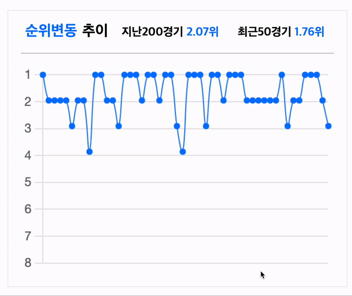
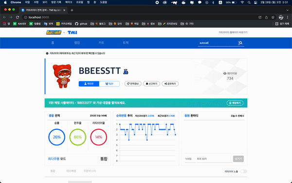

## Api 호출하여 데이터 받고 가공하여 Chart 구현하기

최근 1경기부터 50경기까지 1~8위의 데이터를 라인 차트로 구현하여 유저에게 보여줘야 한다. 라인 차트를 사용하기 위해 여러 가지 라이브러리들을 검색해 봤다.
Recharts와 Chartjs를 먼저 알게 되었는데 Chartjs가 공식 문서에 커스텀 하는 부분이 상세하게 나와있고 가볍다는 장점이 있어 Chartjs를 사용하여 구현하기로 했다.

처음 사용하는 라이브러리이고 주어진 시간은 짧기 때문에 공식 문서가 친절한 Chartjs에 마음이 감ㅋㅋ



## view 작업을 진행하며 구현 사항을 체크했다.

1. Api를 호출하여 유저의 최근 1경기부터 50경기까지 1~8위의 기록을 라인차트로 구현
2. 우측 상단 지난 200경기의 평균 순위, 최근 50경기의 평균 순위 표시

## 1. Api를 호출 유저의 1경기부터 50경기 1~8위의 기록을 라인차트로 구현

Chart.js의 공식 문서를 먼저 살펴보았다. 그 뒤 여러 블로그들을 검색하여 커스텀 하는 방법을 먼저 찾아보고 더미 데이터를 for으로 돌려 x축에 최근 1경기부터 50경기까지의 데이터를 넣고 y 축에 1위~8위의 데이터를 랜덤으로 데이터를 넣었다. 주어진 조건대로 색상과 크기를 커스텀 하였다. 크게 어려운 점 은 없었으나 초반에 버전에 따라 커스텀 하는 방법이 다르다는 걸 인지하지 못해 헤맸다.....

```jsx
const data = {
  // 이전 1경기부터 50경기 x축
  labels: [...labelsArry],
  datasets: [
    {
      label: '순위',
      fill: false,
      lineTension: 0.4,
      backgroundColor: 'rgba(0, 119, 255, 1)',
      borderWidth: 1,
      borderColor: 'rgba(0, 119, 255, 1)',
      borderCapStyle: 'butt',
      borderDash: [],
      borderDashOffset: 0.0,
      borderJoinStyle: 'miter',
      pointBorderColor: 'rgba(0, 119, 255, 1)',
      pointBackgroundColor: 'rgba(0, 119, 255, 1)',
      pointBorderWidth: 2,
      pointHoverRadius: 3,
      pointHoverBackgroundColor: 'rgba(0, 119, 255, 1)',
      pointHoverBorderColor: 'rgba(0, 119, 255, 1)',
      pointHoverBorderWidth: 2,
      pointRadius: 2,
      pointHitRadius: 1,
      // 이전 1경기부터 50경기 순위 데이터
      data: [...rankArry],
    },
  ],
};
```

data에 labels은 x축이다. x축에 1경기부터 50경기까지의 데이터를 담을 예정, lineTension을 사용하여 라인차트의 유연함? 을 커스텀 가능하다. 값이 낮을수록 직선에 가까워진다. 밑에 보더와 포인트 값들로 라인과 포인터의 색상 및 굵기 등을 커스텀가능하다.

```jsx
const options = {
  maintainAspectRatio: false,
  plugins: {
    legend: {
      display: false,
    },
    Tooltip: {
      enabled: true,
    },
  },
  scales: {
    x: {
      display: false,
    },
    yAxis: {
      reverse: true,
      suggestedMin: 1,
      suggestedMax: 8,
    },
  },
};
```

다음 options을 통해 x축을 가리고 y 축을 reverse 하여 상단부터 1위 하단에 8위를 배치하였다. legend의 display false 값으로 차트 타이틀을 가리고, maintainAspectRatio: false를 false로 해주면 상위 div를 무시한 채 창 크기에 따라 크기가 크기가 마음대로 바뀌던 것이 상위 div에 구속된다.

원하는 형태로 view를 그렸으니 api를 호출하여 데이터를 넣어보자!!

차트 컴포넌트는 main.js의 자식요소로 존재한다. 호출한 api를 main.js에서 props로 차트 컴포넌트로 데이터를 넘겨주었다.

우측 상단에 지난 200경기의 평균 순위, 최근 50경기의 평균 순위 표시 해야하고 차트에는 50경기의 데이터만 필요하다.

```jsx
const recent50matches = matchInfo[0].matches
  .filter((match) => match.player.matchRank !== '' && match.player.matchRank !== '99')
  .slice(0, 50);
```

recent50matches 함수에서 slice를 사용하여 필요한 50경기만 먼저 잘라 담았다. 자세히 확인해 보니 간혹 비어있는 값도 있었고 리타이어라고 해서 순위가 기록되지 않는 데이터도 있어 이걸 먼저 필터링하고 50경기만 저장

```jsx
const const50matchesRank =
  recent50matches.map((el) => Number(el.player.matchRank)).reduce((a, b) => a + b) / 50;
```

50경기의 평균 순위를 구하기 위해 map 함수를 사용하여 값을 더하고 저장된 값이 문자열이었기 때문에 숫자로 변경한 뒤 50으로 나누자 소수점이 길게 나오는 경우가 생겼다.

```jsx
{
  Math.round(const50matchesRank * 100) / 100;
}
```

Math.round를 사용해 100을 곱하고 100을 나눠 소수점을 앞에 2자리만 남겨 사용하였다.

지난 200경기의 평균 순위도 동일한 방법으로 구현하였다.

다음은 차트에 적용하기!!

```jsx
const rankArry = recent50matches.map((el) => el.player.matchRank).filter((test) => test <= 8);

const labelsArry = [];
for (let i = 50; i >= 1; i--) {
  labelsArry.push(`이전 ${i}경기`);
}
```

rankArry는 1위 ~ 8위를 기록한 데이터다. filter를 사용해 8위 밑으로는 다 걸러내주었다. Y축에 들어갈 데이터임

labelsArry에는 for 문을 사용하여 1부터 50까지의 숫자를 만들고 Chart.js의 tooltip에 표시가 되기 때문에 `이전 ${i}경기`로 labelsArry에 담아주었다.

<br />



<br />

검색한 유저 정보에 맞게 차트가 변화되는 걸 확인할 수 있다. <br />근데.. 검색한 유저들 실력이 ㅎㄷㄷ하다 카트 장인들ㅋㅋㅋ

### 회고 -

처음 차트를 구현해 보았다. 처음에는 헤맸지만 공식 문서를 자세히 살펴보고 검색을 통해 레퍼런스들을 찾아보니 원하는 답을 찾을 수 있었다. 근데 중요한 건 공식 문서를 먼저 봐야 한다는 사실을 좀 느끼게 되었다. 블로그는 다 다양한 환경에 맞게 만들어진 것을 기록한 글들이 많다. 그래서 나의 상황과 다르기에 오히려 더 혼란을 주는 경우가 많은 거 같다.

데이터를 원하는 대로 가공하는 게 정말 재미있다. 아직 익숙하지 않지만 제일 재미있는 요소인 거 같아 구현하고 나서 코드를 몇 번 다시 본 거 같다.

늦은 시간까지 그리고 주말도 투자하며 좀 더 완성도 있게 마무리 짓고자 노력한 팀원들 정말 고생했다. 아쉬움은 남지만 하는 동안 재미있었고 팀원들과 소통하며 배운 점도 많아 좋았다.

<br />
