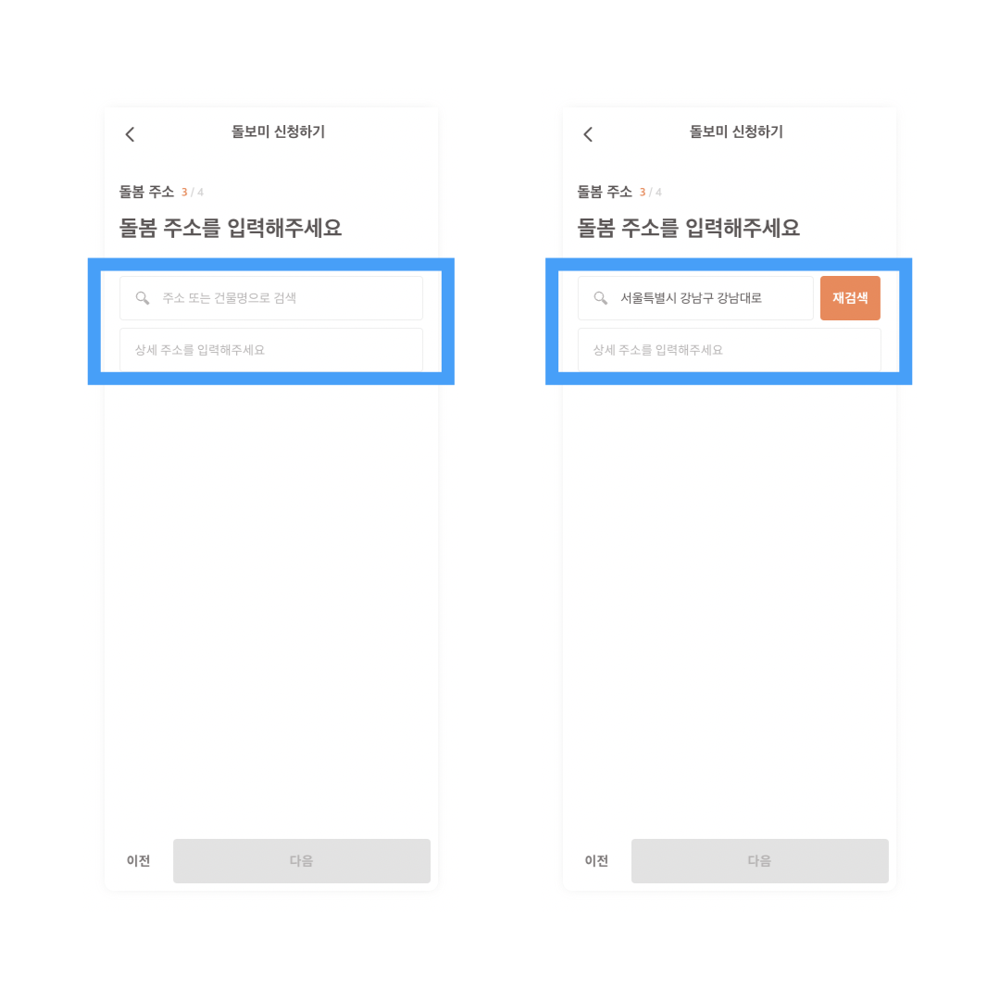

## 주소검색 Api 사용하여 주소검색 컴포넌트 구현하기 - 1

juso.go.kr에서 제공하고 있는 OPEN API를 사용하여 주소검색 기능을 구현하고자 한다🔥 <br />
오늘은 주소검색 컴포넌트 view 작업을 먼저 진행

<br />


<br />

## view 작업을 진행하며 구현 사항을 체크했다.

1. `주소 또는 건물명으로 검색`을 클릭 시 modal 팝업을 사용 `주소검색` 컴포넌트 노출
2. 주소 선택 후 modal 팝업 종료와 선택된 주소 노출 및 재검색 버튼 노출
3. 상세 주소 입력 인풋

<br />


유저가 주소 검색 영역을 클릭 시 modal 팝업을 사용하여 주소 검색 컴포넌트를 노출시킨다. 해당 컴포넌트에서 실질적인 주소 검색 기능이 실행되는 영역이다. view 작업을 하며 우선 체크한 부분은 검색 input 영역 하단에 위치한 검색 안내 가이드 문구는 유저가 검색어를 입력 시 자동완성된 영역에 가려진다는 점이다. 그리고 그 하단에 있는 회색으로 된 주소 입력 가이드 부분도 자동완성된 영역의 크기만큼 줄어든다는 점을 생각하여 작업 진행

```jsx
// 검색한 주소 자동완성 리스트 컴포넌트
<TopAddressListBox>
  <AddressList datas={datas} setIsOpen={setIsOpen} />
</TopAddressListBox>;
{
  onOff() && (
    // 주소검색 가이드라인 컴포넌트
    <TopTextBox>
      <p>
        찾으시려는 도로명 주소의 건물번호 또는 시설명까지
        <br />
        상세히 입력 후 검색해주세요.
        <br />
        예) 중앙동, 불정로432번길
      </p>
    </TopTextBox>
  );
}

// 하단 회색 검색 가이드라인 영역 css
const BottomBox = styled(TopTextBox)`
  width: 100%;
  height: auto;
  min-height: 100%;
  background-color: #f6f6f6;
  align-items: flex-start;
  text-align: left;
  padding: 16px;
`;
```

조건부 연산자를 사용하여 onOff 함수가 실행되었는지에 따라 주소 검색 가이드라인 컴포넌트 혹은 검색한 주소 리스트를 상황에 맞게 노출시켜주었다. 하단의 회색 영역의 주소 검색 가이드라인 컴포넌트는 height 값을 auto와 min-height: 100%를 사용하여 상단의 컴포넌트의 높이 값에 맞춰 높이 값이 변하도록 하였다.

<br />



주소 또는 건물명으로 검색 영역은 유저가 주소를 검색 시 width값이 줄어들며 우측에 재검색 버튼이 생성되어야한다.

```jsx
<AddressTop>
  <MainAddress widthMargin={choiceAddress} onClick={openHandler}>
    {!choiceAddress ? (
      <div>주소 또는 건물명으로 검색</div>
    ) : (
      <div className="choicaAddressFontColor">{choiceAddress.split(' ').slice(0, 3).join(' ')}</div>
    )}
  </MainAddress>
  {!choiceAddress ? null : (
    <AddBTN widthMargin={choiceAddress} onClick={openHandler}>
      재검색
    </AddBTN>
  )}
</AddressTop>;

const MainAddress = styled.div`
  ${(props) => (props.widthMargin ? 'width: 78%' : 'width: 100%')};
  ${(props) => (props.widthMargin ? 'margin-right: 2%;' : 'margin-right: 0;')};
`;
```

유저가 검색 후 선택한 주소를 저장한 상태 값을 기준으로 삼 항 연산자를 사용하여 원하는 기능을 전부 구현할 수 있었다.
먼저 placeholder 메시지인 `주소 또는 건물명으로 검색` 부분 역시 유저가 검색한 주소가 있는지 없는지에 따라 노출 여부를 결정짓고 우측의 재검색 버튼과 주소 검색 영역의 가로 값은 props로 전달하여 css를 조건에 맞춰 실행되도록 하였다.

<br />

### 회고 -

유저의 행동을 상태 관리하며 변화되는 ui를 구성하는 일은 정말 재미있다. 유저가 주소를 검색하게 되면 자동완성 기능을 제공하며 키워드에 맞는 주로 리스트를 제공해야 한다. 해당 컴포넌트는 map 함수를 사용하여 구현할 생각이다. 그래서 컴포넌트를 따로 만들어둔 상태다. 내일은 OPEN API를 활용하여 주소 검색 기능을 완성 시킬 예정이다. 팀원들이랑 시간이 갈수록 소통도 더 잘 되고 역할 분담도 잘되고 있는 거 같다. 지난주에 이야기한 대로 redux를 활용하여 상태 관리를 하기로 했다. 나는 유저가 검색 후 선택한 주소 와 유저가 입력한 상세주소를 redux를 활용하여 상태를 저장하면 될 거 같다.

<br />
