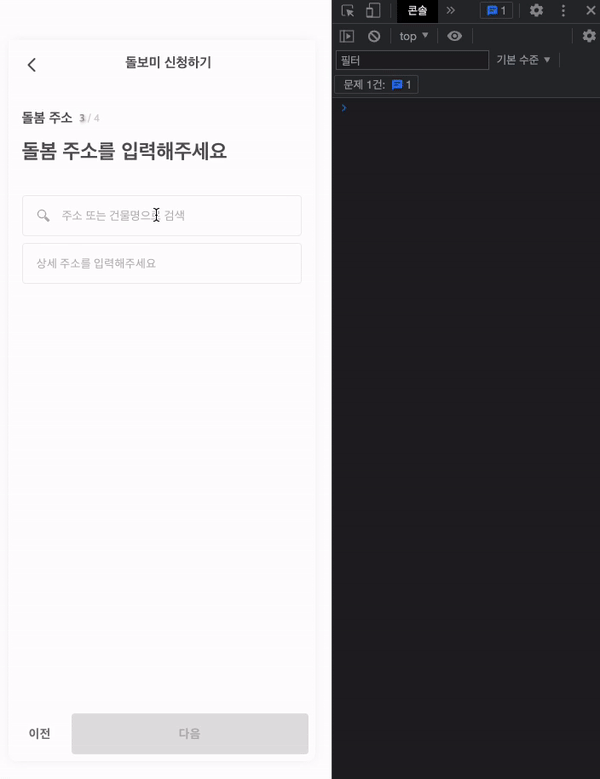
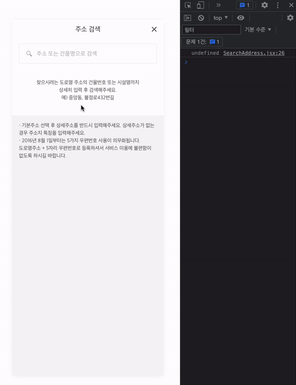
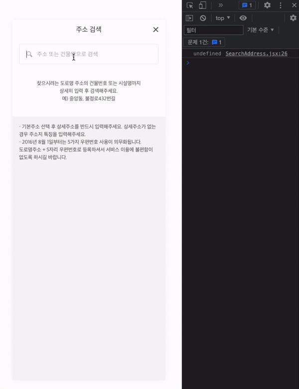

## 주소검색 Api 사용하여 주소검색 컴포넌트 구현하기 - 2

view 작업은 어제 끝냈다. 이제 OPEN API를 활용하여 주소 검색 기능을 구현하고 redux를 사용하여 유저가 검색한 주소 + 입력한 상세주소를 저장하는 부분까지 진행하였다.

<br />


<br />

## 구현 사항 체크

1. Axios를 사용하여 OPEN API를 받아 주소 검색 및 검색한 주소 자동완성 기능 구현
2. 상세주소 처리

<br />

## 1. Axios를 사용하여 OPEN API를 받아 주소 검색 및 검색한 주소 자동완성 기능 구현

실질적인 검색 기능이 실행되는 modal 팝업에서 axios를 활용하여 juso.go.kr에서 제공하고 있는 OPEN API를 받아왔다. 주소를 검색하는 input에 입력된 값을 useRef를 사용하여 addAddress에 담아 api의 `keyword=${addAddress.current.value}`부분에 들어갈 수 있도록 하였다. 그리고 autosearch라는 함수에 api를 받아 useState를 사용하여 datas에 검색한 주소를 저장, console.log로 api 호출이 잘 되는지 확인하였다.

```jsx
const addAddress = useRef(null);
const [datas, setDatas] = useState();

const autoSearch = () => {
  const fetchData = async (url) => {
    const { data } = await axios.get(url);
    setDatas(data.results.juso);
  };
  fetchData(
    `https://www.juso.go.kr/addrlink/addrLinkApi.do?currentPage=1&countPerPage=10&keyword=${addAddress.current.value}&confmKey=${process.env.REACT_APP_API_KEY}&resultType=json`,
  );
};

console.log(datas);

<SearchBox>
  <MainAddress
    placeholder="주소 또는 건물명으로 검색"
    ref={addAddress}
    onChange={debounceOnChange}
  />
</SearchBox>;
```

<br />



<br />

## 1-2. datas를 props로 AddressList 컴포넌트에 전달 map함수를 사용하여 검색 된 주소 리스트 생성

AddressList 컴포넌트는 검색 된 주소 키워드를 바탕으로 자동완성 기능과 키워드와 동일한 주소들을 리스트로 제공한다.
유저가 주소를 선택과 동시에 modal 팝업이 닫혀야 하기 때문에 modal의 상태 값도 props로 전달받았다. 유저가 주소를 검색하기 전에는 input 하단에 검색 가이드라인을 제공하는 메시지가 있다. 하지만 주소를 검색하면 그 부분이 사라지고 검색한 주소 리스트를 보여주어야 하기 때문에 datas를 searchAddressList에 담아 listSearchAddress 함수에서 조건문을 실행하여 검색된 주소가 없으면 빈 공간을 제공하여 가이드 메시지를 노출하고 검색된 내용이 있으면 map을 사용하여 리스트를 생성, 노출시켰다. selectAddress 함수에서는 유저가 검색 후 선택한 주소를 dispatch 하여 redux에 상태 저장과 동시에 modal 팝업을 닫아주는 함수를 만들었다.

```jsx
const AddressList = ({ datas, setIsOpen }) => {
  const searchAddressList = datas;
  const dispatch = useDispatch();
  const selectAddress = (datas) => {
    dispatch(setAddress(datas));
    setIsOpen(false);
  };
  const listSearchAddress = () => {
    if (!searchAddressList) return;
    return searchAddressList.map((el, idx) => (
      <ListBox
        className="list_box"
        key={idx}
        onClick={() => {
          selectAddress(el);
        }}
      >
        <LeftBox>
          <TopText>
            <h1>{el.roadAddr}</h1>
          </TopText>
          <BottomText>
            <span>지번</span>
            <p>{el.jibunAddr}</p>
          </BottomText>
        </LeftBox>
        <RightBox>
          <h1>{el.zipNo}</h1>
        </RightBox>
      </ListBox>
    ));
  };
  return <>{listSearchAddress()}</>;
};
```

## 1-3. 유저가 검색 후 선택한 주소를 useSelector를 사용하여 choiceAddress에 저장

useSelector를 사용하여 유저가 선택한 주소를 redux에서 불러와 choiceAddress에 담아 choiceAddress의 상태를 기준으로 삼 항 연산사를 사용 검색한 주소 혹은 주소 또는 건물명으로 검색이라는 텍스트를 상황에 맞게 노출시켰다.

예를 들어 `서울특별시 강남구 강남 대로 328(역삼동)`을 선택했을 시 해당 주소를 전부 다 저장하지만 상세주소를 입력하는 페이지에서는 `서울특별시 강남구 강남 대로`까지만 유저에게 보여줘야 한다. 아마도 긴 주소 때문에 주소를 노출하는 input의 ui 이가 깨지는 것을 방지하기 위함이라 생각한다. 그래서 split, slice, join을 사용하여 공백을 기준으로 3번째 배열을 잘라 원하는 주소를 노출시켰다.

```jsx
const choiceAddress = useSelector((state) => state.address.roadAddr);

<MainAddress widthMargin={choiceAddress} onClick={openHandler}>
  {!choiceAddress ? (
    <div>주소 또는 건물명으로 검색</div>
  ) : (
    <div className="choicaAddressFontColor">{choiceAddress.split(' ').slice(0, 3).join(' ')}</div>
  )}
</MainAddress>;
```

<br />

## 2. 상세주소 처리

마지막으로 유저가 상세주소를 입력하면 하단의 다음 버튼이 활성화되며 클릭 시 최종 주솟값을 redux에 저장 다음 페이지로 이동하는 일만 남았다. useRef를 사용하여 유저가 입력한 상세주소를 detailAddress에 담고, dispatch를 사용하여 onSetUserAddress 함수에 담아 실행한다. 하지만 상세주소를 입력 후 다음 스텝을 위한 저장 버튼? 외따로 존재하지 않기 때문에 onBlur를 사용하여 input에서 focus가 벗어났을 시 함수가 실행하도록 하였다.

```jsx
const detailAddress = useRef('');
// 상세 주소 리덕스 상태 저장
const onSetUserAddress = () => {
  dispatch(setUserAddress(detailAddress.current.value));
};

<AddressBottom>
  <DetailedAddress
    ref={detailAddress}
    onBlur={onSetUserAddress}
    onChange={setButtonActive}
    placeholder="상세 주소를 입력해주세요"
  />
</AddressBottom>;
```

사실 onBlur를 이번에 처음 알게 되었다. 해당 부분을 진행하다가 막히는 부분이 있어 팀장님에게 조언을 구했다. 그래서 알게 되었고 사용하게 된 onBlur인데 잘 알아두면 input 관련 event를 처리할 때 유용하게 사용할 수 있겠다는 생각이 들었다. 그리고 공부해야할 부분이 많고.. 부족하니 응용력도 떨어진다는 걸 느꼈다..허허..

```jsx
onFocus : 포커스를 받은 경우 이벤트 설정
onBlur : 포커스가 해지될 때 이벤트 설정
```

기능을 구현하고 난 뒤 팀원들과 테스트를 하던 도중 검색어를 입력할 때마다 api 호출을 하는 것을 확인하였다. 예를 들어 강남을 검색할 시 강남까지만 타이핑해도 한 번의 api 호출이 발생하는데 뒤이어 ㅁ을 타이핑하여 강남이라는 글자가 완성되면 2번의 api 호출이 발생된다. 또 강남을 지우고 다른 검색어를 입력하려 하면 지우는 동안 또 한 번의 api 호출 그리고 새로운 검색어를 입력하며 또다시 api를 불필요하게 호출되는 것이다. 팀 프로젝트 발표 시간에 다른 조에서 비슷하게 검색 기능을 구현할 때 불필요한 api 호출을 막기 위해 debouce를 사용했다는 이야기를 듣고 debounce를 적용하기로 하였다.

<br />



<br />

프로젝트 제출 시간이 얼마 남지 않았기 때문에 lodash 라이브러리를 사용하여 구현하기로 했다. debounceOnChange 함수에 api 호출 및 데이터 저장을 하는 autoSearch를 debounce 함수로 묶고 원하는 딜레이 시간을 설정하였다.

```jsx
  npm install lodash

  // 디바운스 - api 요청 딜레이
  const debounceOnChange = debounce(autoSearch, 350);
```

<br />



<br />

적용 후 불필요한 api호출이 줄어든것을 console.log를 통해 확인하였다 .Debounce 는 여러번 발생하는 이벤트에서, 가장 마지막 이벤트 만을 실행 되도록 만드는 개념이다.
검색 기능에서 입력이 끝난 350ms 동안 동일한 이벤트가 계속해서 발생 한다면, 입력이 끝날때, 가장 마지막 이벤트만을 실행하여, 성능성 유리함을 가져올 수 있다.

<br />

### 회고 -

개인적으로 이번 프로젝트는 재미있었다. 막히는 부분이 많아 팀원들의 도움도 많이 받았고, 새롭게 알게된 부분도 많다. debounce와 redux를 사용하는 개념도 더 잡힌 거 같아 여러모로 즐거운 프로젝트였다. 다음주도 화이팅!!

<br />
