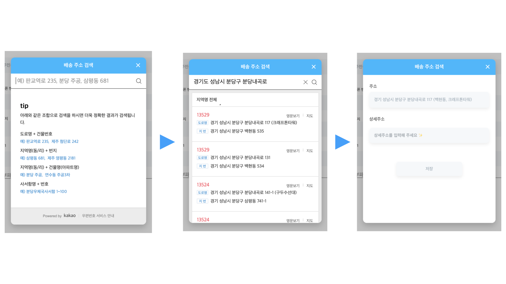
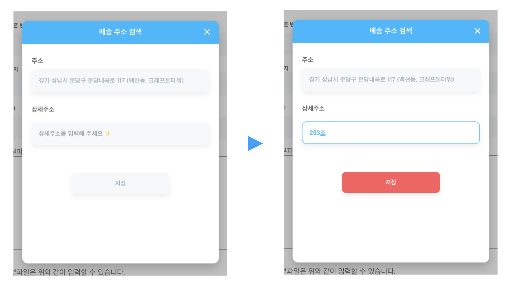
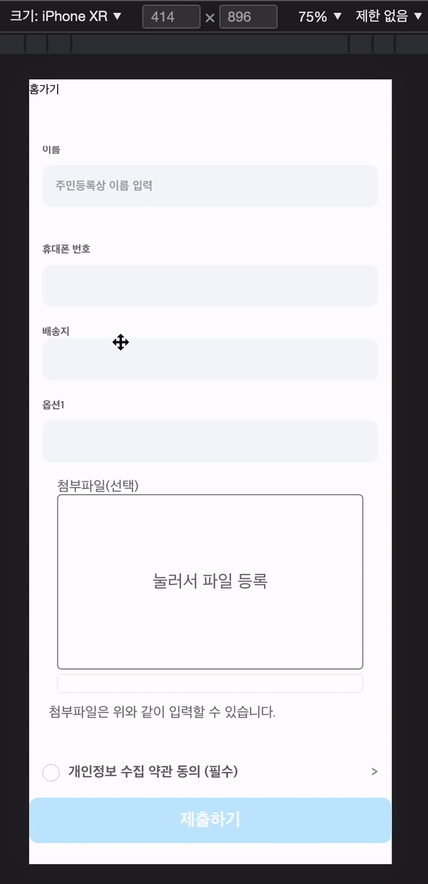

## react-daum-postcode 사용하여 주소검색 기능 구현하기

react-daum-postcode는 사용법이 정말 간단하다는 장점이 있다. 그래서 주소 검색 컴포넌트를 진행하는 프로젝트 테마에 맞게 커스텀 하는데 좀 더 포커스를 맞추고 진행하였다.

<br />

> 참고 [카카오 우편번호 서비스](https://postcode.map.daum.net/guide)<br />
> 참고2 [react-daum-postcode](https://www.npmjs.com/package/react-daum-postcode)

<br />


<br />

## 구현 사항 체크

1. react-daum-postcode 사용 주소 검색 기능 구현
2. modal을 사용하여 주소 검색 노출, 주소 선택 후 선택한 주소와 상세주소 입력 부분 노출
3. 상세주소 입력 여부에 따라 저장 버튼 활성화 및 비활성화
4. 데스크탑 사이즈에서는 modal 팝업 모바일 사이즈에서는 화면에 가득 채우기 - 반응형

<br />

## 1. react-daum-postcode 사용 주소 검색 기능 구현

## 설치

```jsx
npm install react-daum-postcode
// or
yarn add react-daum-postcode
```

## 사용

```jsx
import React from 'react';
import DaumPostcode from 'react-daum-postcode';

const Postcode = () => {
  const handleComplete = (data) => {
    let fullAddress = data.address;
    let extraAddress = '';

    if (data.addressType === 'R') {
      if (data.bname !== '') {
        extraAddress += data.bname;
      }
      if (data.buildingName !== '') {
        extraAddress += extraAddress !== '' ? `, ${data.buildingName}` : data.buildingName;
      }
      fullAddress += extraAddress !== '' ? ` (${extraAddress})` : '';
    }

    console.log(fullAddress); // e.g. '서울 성동구 왕십리로2길 20 (성수동1가)'
  };

  return <DaumPostcode onComplete={handleComplete} {...props} />;
};
```

<br />

위 절차대로 진행하면 바로 주소검색 기능을 사용가능하다. 이제 원하는대로 커스텀해서 사용하면되는데 가이드라인 문서를 확인해보면 원하는 기능을 확인하고 사용가능하다.

<br />

## 2. modal을 사용하여 주소 검색 노출, 주소 선택 후 선택한 주소와 상세주소 입력 부분 노출

주소 검색 컴포넌트 상단에 프로젝트 메인 컬러를 사용하여 Title 영역을 만들고 그 아랫부분에 주소 검색 + 상세 주소 입력 컴포넌트를 사용하였다. useState를 사용하여 modal의 상태를 관리하며 주소 검색 영역을 클릭 시 modal을 노출시켰다. 모달의 부모 요소의 크기는 화면 영역의 전체를 차지하며 opacity를 사용 투명도를 주었다. keyframes을 사용하여 부모 요소는 모달 이벤트가 발생 시 fadein으로 화면에 노출되며, 주소 검색 컴포넌트는 위에서 아래로 내려오는 애니메이션을 적용하였다.

```css
// 주소 검색 컴포넌트 부모요소 css

const SearchAddressBox = styled.div`
  width: 100%;
  height: 100vh;
  background-color: rgba(0, 0, 0, 0.25);
  position: fixed;
  top: 0;
  left: 0;
  animation: boxFade 0.35s ease;
  @keyframes boxFade {
    0% {
      opacity: 0;
    }
    100% {
      opacity: 1;
    }
  }
`;

// 주소 검색 컴포넌트 css

const Container = styled.div`
  width: auto;
  height: auto;
  position: absolute;
  top: 50%;
  left: 50%;
  transform: translate(-50%, -50%);
  border-radius: 12px;
  box-shadow: 0px 8px 20px rgba(0, 0, 0, 0.2);
  animation: containerFade 0.35s ease;
  @keyframes containerFade {
    0% {
      top: 42.5%;
    }
    100% {
      top: 50%;
    }
  }
`;
```



위 이미지 좌측부터 1번 2번은 daumpostcode를 통해 진행되는 절차이고, 마지막 상세주소를 입력하는 부분은 DetailAddress라는 컴포넌트를 만들고, 유저가 검색하고 선택한 주소는 userSelectAddress에 저장하여, userSelectAddress에 선택된 주소가 있는지 없는지에 따라 DetailAddress 컴포넌트가 노출되게 구조를 짰다.

```jsx
// 유저가 선택한 주소 상태 관리
const [userSelectAddress, setUserSelectAddress] = useState();

const handleComplete = (data) => {
  let fullAddress = data.address;
  let extraAddress = '';

  if (data.addressType === 'R') {
    if (data.bname !== '') {
      extraAddress += data.bname;
    }
    if (data.buildingName !== '') {
      extraAddress += extraAddress !== '' ? `, ${data.buildingName}` : data.buildingName;
    }
    fullAddress += extraAddress !== '' ? ` (${extraAddress})` : '';
  }
  setUserSelectAddress(fullAddress);
};

<SearchAddressBox>
  <Container
    onClick={(event) => {
      event.stopPropagation();
    }}
  >
    <Title>
      <Text>배송 주소 검색</Text>
      <Icon onClick={isClose}>&times;</Icon>
    </Title>
    {userSelectAddress ? (
      <DetailAddress userSelectAddress={userSelectAddress} setIsOpen={setIsOpen} id={id} />
    ) : (
      <DaumPostcode
        className="post_code"
        style={postCodeStyle}
        onComplete={handleComplete}
        {...props}
      />
    )}
  </Container>
</SearchAddressBox>;
```

<br />

## 3. 상세주소 입력 여부에 따라 저장 버튼 활성화 및 비활성화



useRef를 사용하여 상세 주소를 입력하는 input의 값을 buttonDisabled에 저장하고 상태를 관리하였다.
onButtonHandler 함수로 버튼 활성화 및 비활성화를 핸들링하고, completeAddress 유저가 검색한 주소와 상세주소를 dispatch를 사용하여 redux에 상태를 저장함

<br />

```jsx
const [buttonDisabled, setButtonDisabled] = useState(false);
const choiceAddress = useRef();
const dispatch = useDispatch();
const onButtonHandler = (e) => {
  if (choiceAddress.current.value.length) {
    setButtonDisabled(true);
  } else {
    setButtonDisabled(false);
  }
};

const completeAddress = () => {
  dispatch(addSubmitData(id, userSelectAddress + choiceAddress.current.value));
  setIsOpen(false);
};

<DetailAddressBox>
  <Label>주소</Label>
  <SelectAddress>{userSelectAddress}</SelectAddress>
  <Label>상세주소</Label>
  <UserDetailAddress
    placeholder="상세주소를 입력해 주세요 ✨"
    ref={choiceAddress}
    onChange={onButtonHandler}
  />
  <SaveButton disabled={!buttonDisabled} onClick={completeAddress}>
    저장
  </SaveButton>
</DetailAddressBox>;
```

<br />

저장 버튼 css에 props disabled를 전달, disabled에는 buttonDisabled의 상태 기준으로 삼 항 연산자를 사용하여 버튼의 활성화 및 비활성화 상태에 맞게 색상이 변경되도록 설정함.

<br />

```css
const SaveButton = styled.button`
  width: 55%;
  height: 45px;
  color: #fff;
  margin-top: 30px;
  font-size: 0.85rem;
  font-weight: bold;
  border-radius: 8px;
  background-color: #ff5a5f;
  box-shadow: 0px 5px 10px rgba(200, 200, 200, 0.3);
  cursor: pointer;

  ${(props) =>
    props.disabled
      ? `
  color: #aab8c2;
  background-color: #f5f8fa;
  cursor: default;
  `
      : ``}
`;
```

<br />

## 4. 데스크탑 사이즈에서는 modal 팝업 모바일 사이즈에서는 화면에 가득 채우기 - 반응형

위 내용은 데스크탑 기준이다. `<DaumPostcode>` 컴포넌트에 Media Query를 사용하여 가로 값이 414px 이하일 경우에는 주소 검색 컴포넌트가 화면의 전체를 차지할 수 있도록 설정하여 반응형을 구현하였다.

<br />



테스크탑 css는 postCodeStyle 함수를 통해 데스크탑에 맞춰 설정한 가로와 세로값을 반영한다.

```jsx
<DaumPostcode className="post_code" style={postCodeStyle} />
```

```jsx
const postCodeStyle = {
  width: '100%',
  minWidth: '420px',
  height: '470px',
  overflow: 'scroll',
  borderRadius: '0 0 12px 12px',
};
```

<br />

DaumPostcode 컴포넌트에 className을 주고 Media Query를 설정하여 가로 값이 400px일 경우 화면의 전체 영역을 차지하도록 하였다.

```css
const Container = styled.div`
  width: auto;
  height: auto;
  position: absolute;
  top: 50%;
  left: 50%;
  transform: translate(-50%, -50%);
  border-radius: 12px;
  box-shadow: 0px 8px 20px rgba(0, 0, 0, 0.2);
  animation: containerFade 0.35s ease;
  @keyframes containerFade {
    0% {
      top: 42.5%;
    }
    100% {
      top: 50%;
    }
  }
  .post_code {
    @media (max-width: 400px) {
      width: 100% !important;
      height: 92vh !important;
      padding: 0 10px;
    }
  }
`;
```

<br />

이번 프로젝트에서는 설문지 양식을 사용자가 원하는 대로 선택하여 만들고 설문지를 입력하는 유저 페이지를 따로 만드는 형태였다. 그래서 설문지에 포함될 각 기능들을 하나의 redux로 상태 관리하여 사용하기로 기획하였다.

```jsx
// submit.js

const ADD_SUBMIT_DATA = 'submit/ADD_SUBMIT_DATA';
const INIT_SUBMIT_DATA = 'submit/INIT_SUBMIT_DATA';

export const addSubmitData = (key, value) => ({
  type: ADD_SUBMIT_DATA,
  key,
  value,
});
export const initSubmitData = (key, value) => ({ type: INIT_SUBMIT_DATA });

const initialState = {};

export default function submit(state = initialState, action) {
  switch (action.type) {
    case ADD_SUBMIT_DATA:
      return {
        ...state,
        [action.key]: action.value,
      };
    case INIT_SUBMIT_DATA:
      return {};
    default:
      return state;
  }
}
```

```jsx
// index.js

import { combineReducers } from 'redux';
import submit from './submit';

//! 한프로젝트에 리듀서가 여러개일경우 한 리듀서로 합쳐사용한다.
//! 합쳐진 리듀서를 루트 리듀서라고 부른다.

const rootReducer = combineReducers({ submit });

export default rootReducer;

//store 생성은 src/index.js에서
```

<br />

### 회고 -

daumpostcode는 juso.go.kr에서 제공하는 OPEN API보다 사용 방법이 간단하고 커스텀 할 영역이 적어 기능 구현하는 시간 단축의 장점을 가지고 있다. 레퍼런스와 가이드 문서가 잘 되어있어 처음 사용해도 어려움 없이 적용 가능한 거 같다.

<br />
