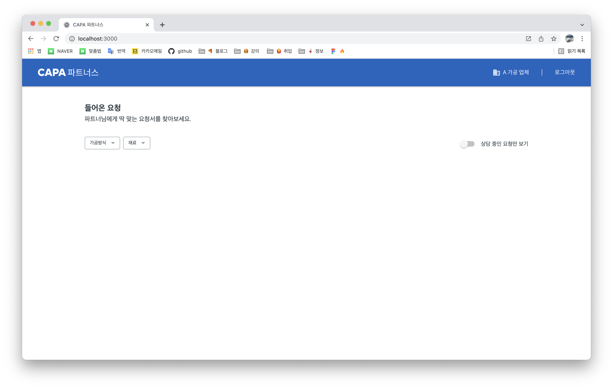
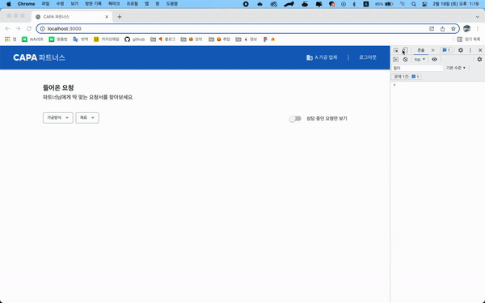

<br />

### 오늘한일 👨🏻‍💻 .
> 1. 면접준비 🔥
> 2. 코딩테스트 ⚙️

<br />

### 기록 ✍🏻 .

- 이력서를 제출한 회사에서 연락이 왔다. 알고리즘 테스트가 아닌 실무에 가까운 내용으로 구성된 과제 느낌 피그마 url과 json 파일을 메일로 받음 피그마 내용대로 뷰 작업부터 진행했다

<br />


<br />

### 프로젝트 폴더 구조

> App.js에 Navigation 컴포넌트를 불러와 사용, Navigation 컴포넌트 안에서 MobileMenu를 모달 팝업 형태로 사용

<br />



- 주어진 조건 중 반응형을 적용하여 모바일 사이즈가 되었을 시 상단의 네비게이션이 햄버거 메뉴 버튼과 로고만 남고 햄버거 메뉴 버튼을 클릭 시 좌측에서 우측으로 fade-in 애니메이션을 적용하는 조건이 있어 이 작업부터 진행함, 추가적으로 햄버거 메뉴가 나올 시 우측 빈 여백을 클릭하여 햄버거 메뉴를 닫는 기능까지 추가함

<br />



<br />

- 네비게이션 컴포넌트를 style-component, @media screen를 사용하여 가로값이 500px이 되었을때 모바일 메뉴로 변경

```css
      const NavBox = styled.div`
        @media screen and (max-width: 500px) {
          #mb_menu {
          display: none;
          margin-right: 19px;
        }

        @media screen and (max-width: 500px) {
          width: 100%;
          padding-left: 23px;

          #ateam_logo {
            width: 91.8px;
            height: 12px;
          }
          #mb_menu {
            display: block;
          }
        }
      ` 
      const AnotherBox = styled(LogoBox)`
        justify-content: flex-end;
        padding-left: 0;
        padding-right: 40px;

        @media screen and (max-width: 500px) {
          display: none;
        }
      }
    `
```
<br />

- Navigation 컴포넌트는 데스크탑 사이즈에서 노출된다. MobileMenu 컴포넌트는 모바일 사이즈가 되었을 시 display: bolck을 사용하여 노출시켜주므로 각자 정해진 가로 값에 반응하여 노출된다. 모바일 메뉴는 Navigation 컴포넌트에서 useState를 사용하여 메뉴 오픈 상태 관리를 하며 props로 MobileMenu 컴포넌트에 openModal 함수를 전달하여 모바일 메뉴 클릭 시 useState 상태 값을 ture로 변경하여 메뉴를 오픈한다. 모바일 메뉴 영역 밖을 클릭 시 useEffect를 사용하여 "mousedow" 이벤트를 감지하고 handleClickOutside 함수로 모바일 메뉴 상태 값을 false로 변경하여 메뉴를 닫게 하고 useRef를 사용하여 Navigation 컴포넌트 영역을 설정

```jsx
Navigation.js

const Navigation = () => {
  const wrapperRef = useRef();
  const [modalOpen, setModalOpen] = useState(false);
  const openModal = () => {
    setModalOpen(true);
  };
  useEffect(() => {
    document.addEventListener("mousedown", handleClickOutside);
    return () => {
      document.removeEventListener("mousedown", handleClickOutside);
    };
  });

  const handleClickOutside = (event) => {
    if (wrapperRef && !wrapperRef.current.contains(event.target)) {
      setModalOpen(false);
    }
  };

  return (
    <>
      <NavBox ref={wrapperRef}>
        {/* 데스크탑 네비게이션 */}
        <LogoBox>
          {/* 모바일 네비게이션 */}
          <MobileMenuBar id="mb_menu" onClick={openModal} />
          <AteamLogo id="ateam_logo" />
        </LogoBox>
        <AnotherBox>
          <BtnTwo>
            <NavIcon fill="#fff" />
            <NavText>A 가공 업체</NavText>
          </BtnTwo>
          <Line />
          <LogOutBtn>로그아웃</LogOutBtn>
        </AnotherBox>
      </NavBox>
      <MobileMenu open={modalOpen} />
    </>
  );
};
```
```jsx
MobileMenu.js
const MobileMenu = (props) => {
  const { open } = props;
  return (
    <>
      <ModalBox className={open ? "openModal modal" : "modal"}>
        {open ? (
          <ModalBackground>
            <ModalContents>
              <ModalHead>
                <LogoBlue />
              </ModalHead>
              <ModalBody>
                <BtnTwo>
                  <NavIcon fill="#323D45" />
                  <NavText>A 가공 업체</NavText>
                </BtnTwo>
                <LogOutBtn>로그아웃</LogOutBtn>
              </ModalBody>
            </ModalContents>
          </ModalBackground>
        ) : null}
      </ModalBox>
    </>
  );
};
```
<br />

- 모바일 메뉴 오픈 시 좌측에서 우측으로 밀려들어오는 fade-in 에니메이션과 메뉴 뒷배경 에니메이션은 @keyframes을 사용하여 적용

```css
- 뒷배경 에니메이션

const ModalBackground = styled.div`
  width: 100%;
  height: 100vh;
  overflow: hidden;
  background-color: rgba(50, 61, 69, 0.5);
  position: fixed;
  top: 0;
  left: 0;
  z-index: 9;

  animation: fadeInBackground 0.35s;

  @keyframes fadeInBackground {
    from {
      opacity: 0;
    }
    to {
      opacity: 1;
    }
  }
`;
```
```css
- 좌측에서 우측으로 에니메이션

const ModalContents = styled.div`
  width: 75%;
  height: 100vh;
  overflow: hidden;
  background-color: #fff;
  animation: fadeInModal 0.45s;

  @keyframes fadeInModal {
    from {
      opacity: 0;
      margin-left: -600px;
    }
    to {
      opacity: 1;
      margin-left: 0;
    }
  }
`;
```
<br />

### 내일은 toggle 버튼 작업 🔥

<br />
<br />
