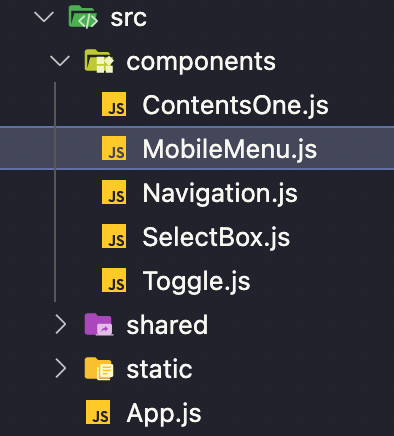
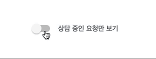

<br />

### 오늘한일 👨🏻‍💻 .
> 1. 면접준비 🔥
> 2. 코딩테스트 ⚙️

<br />

### 기록 ✍🏻 .

- 오늘은 필터링 기능을 가진 toggle버튼 뷰 작업 진행

<br />



<br />

### 프로젝트 폴더 구조

> ContentsOne.js에 Toggle 컴포넌트를 불러와 사용

<br />



- json-server를 컨텐츠 하단 카드 리스트는 뷰작업을 다 끝낸 뒤에 할 계획이다. 주어진 조건에 맞는 뷰작업을 먼저 진행
- Toggle 버튼은 useState를 사용하여 버튼이 클릭되었는지 상태 값을 관리하며 onClick을 사용하여 버튼 이벤트를 관리, 토글 버튼 백그라운드와 동그라미 버튼의 색상 변화는 props로 전달하여 상태 값에 맞는 색상을 삼항연산자를 사용하여 적용함, 자연스러운 색상 변화 적용을 위해 transition을 사용

<br />

```jsx
Toggle.js

const Toggle = (props) => {
  const [toggle, setToggle] = React.useState(false);

  return (
    <ToggleContainer>
      <ToggleSwitch
        onClick={() => {
          setToggle(!toggle);
        }}
      >
        <ToggleBgColor bgColor={toggle}></ToggleBgColor>
        <ToggleBtn position={toggle} bgColor={toggle}></ToggleBtn>
      </ToggleSwitch>
    </ToggleContainer>
  );
};
```
```css
Toggle.js

const ToggleContainer = styled.div`
  width: auto;
  cursor: pointer;
`;

const ToggleSwitch = styled.div`
  width: 34px;
  height: 14px;
  background-color: #c2c2c2;
  border-radius: 20px;
  margin: 0 auto;
  position: relative;
  overflow: visible;
`;

const ToggleBgColor = styled.div`
  height: 100%;
  display: inline-block;
  background-color: #bbdefb;
  border-radius: 20px;
  ${(props) => (props.bgColor ? "width: 34px" : "width: 0")};
`;

const ToggleBtn = styled.div`
  width: 20px;
  height: 20px;
  position: absolute;
  top: 50%;
  transform: translateY(-50%);
  border-radius: 50%;
  box-shadow: 0px 2px 2px rgba(0, 0, 0, 0.24);
  ${(props) => (!props.position ? "left: -3px" : "left: 17px")};
  ${(props) => (props.bgColor ? "background: #2196F3" : "background: #f5f5f5")};
  transition: all 0.25s ease-out;
`;
```

<br />

토글버튼 작동 테스트를 위해 여러 번 클릭을 하다 보니 우측의 텍스트가 드래그 되는 현상이 싫었다. 유저 입장에서도 보기 좋지 않고 불편할 거 같은 느낌이 들어 토글버튼 영역은 드레그가 되지 않도록 부모컴포넌트 ContentsOne에 user-select: none을 추가하여 드레그를 막아 줌

```css
ContentsOne.js
토글버튼을 감싸고있는 영역

const ContentBoxTwo = styled.div`
  -webkit-user-select: none;
  -moz-user-select: none;
  -ms-user-select: none;
  user-select: none;
`;

```

<br />

### 내일은 Select버튼 작업 🔥

- 셀렉트 버튼도 필터링 기능을 담당하며 드롭다운 형태로 체크박스를 추가적으로 제공한다. 생각보다 할게 많음..

<br />
<br />
