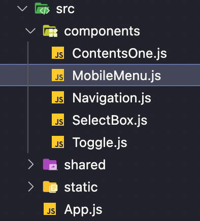
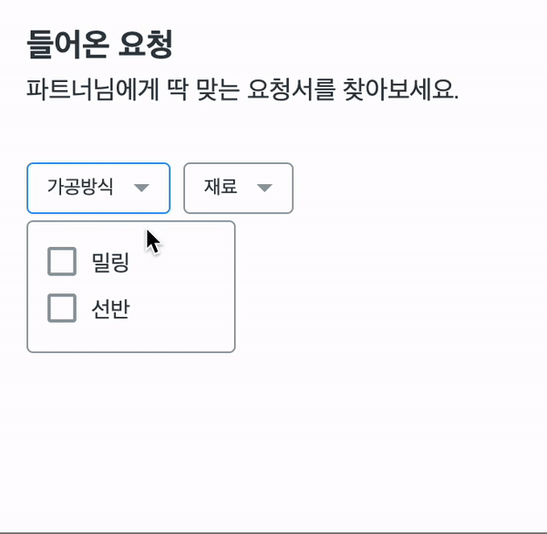
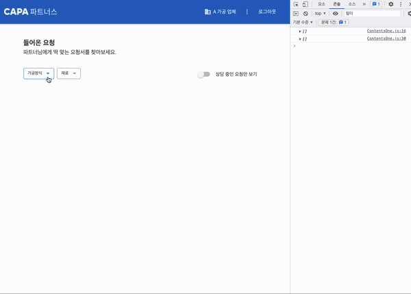

<br />

### 오늘한일 👨🏻‍💻 .
> 1. 면접준비 🔥
> 2. 코딩테스트 ⚙️

<br />

### 기록 ✍🏻 .

- 오늘은 필터링 기능을 가진 Select버튼 뷰 작업 및 기능 초반 작업 진행

<br />



<br />

### 프로젝트 폴더 구조

> ContentsOne.js에 SelectBox 컴포넌트를 불러와 사용

<br />



### Select버튼 조건
 1. Select버튼에 마우스hover 시 border색상 변경 + 화살표 icon색상도 변경함
 2. Select버튼 클릭 시 DropDown으로 체크박스 리스트 오픈 + 에니메이션 추가로 자연스러운 움직임 추가함
 3. 체크박스 클릭 시 셀렉트 버튼 백그라운드 컬러 변경과 텍스트 컬러변경, 우측에 체크된 숫자만큼 숫자 표시
 4. 체크박스 클릭 시 셀렉트 버튼 우측에 필터링 리셋 ui추가, 리셋 클릭 시 체크된 거 초기화 + 상단에서 하단으로 자연스럽게 내려오는 에니메이션 추가함

<br />

### 1. Select버튼에 마우스hover 시 border색상 변경 + 화살표 icon색상도 변경함
- hover + transition을 사용하여 border색상을 변경
- 셀렉트 버튼 우측에 위치한 화살표 아이콘은 이미지 파일로 사용할까 고민했지만, 이미지 사이즈가 너무 작아 피그마에서 svg로 저장하여 컴포넌트로 불러와 사용했다. 장점은 svg는 벡터이기 때문에 작은 사이즈에서 선명한 화질이 제공되며 아이콘의 fill color를 currentcolor로 설명하면 원하는 색상으로 변경이 가능하기 때문에 이미지 파일 두개 사용할걸 한 개로 대체 가능하다. <br /><br />( 화살표 아이콘을 여러색상으로 다양한곳에서 사용하게된다면 각각 이미지 색상별로 저장하고 번거롭다. 하지만 svg를 사용하면 하나의 svg파일로 원하는 곳에 원하는 컬러값을 사용하여 이용가능 편하고 좋다 😎 )

```css
SelectBox.js

const DropDownBtn = styled.div`

  &:hover {
    border: 1px solid #2196f3;
    transition: all 0.25s ease-out;
  }

  &:hover > .ArrowCss {
    fill: #2196f3;
    transition: all 0.25s ease-out;
  }

  &:not(hover) {
    border: 1px solid #939fa5;
    transition: all 0.25s ease-out;
  }

  .ArrowCss {
    margin-left: 12px;
  }
`;
```
- &:not(hover)는 마우스 hover의 반대 상황 hover 시에는 자연스러운 컬러 변화가 있지만 not hover를 안 해주면 반대로 마우스 위치가 영역에서 벗어나면 자연스럽지 못하게 보더 컬러가 변경된다. 아무리 생각해도 부자연스러워 사용함<br />사소한 부분이지만 이런 디테일이 중요하다고 멘토님께 이야기 들은 적 있다. 나 또한 중요하다고 생각한다.

<br />

### 2. Select버튼 클릭 시 DropDown으로 체크박스 리스트 오픈 + 에니메이션 추가로 자연스러운 움직임 추가함
- useState를 사용하여 드롭다운의 열림과 닫힘 상태 관리를 함, 드롭다운 이 열렸을 시 @keyframes을 사용하여 상단에서 하단으로 내려오는 자연스러운 움직임을 추가했다. 이 프로젝트를 진행하는 동안 동적인 변화가 생기는 부분은 동일한 애니메이션을 적용하여 통일된 모습을 적용하고 싶었다.
- 추가로 드롭다운 이 열리는 셀렉트 버튼이 2개인데 둘 다 열었을 시 드롭다운 메뉴가 겹쳐 보였다. 이 부분이 셀렉트 버튼을 이용하는 유저 입장에서 불편함을 초래할 거 같다고 판단하여 앞서 모바일 메뉴 작업과 동일하게 드롭다운 영역 밖 클릭을 감지하여 영역 밖을 클릭 시 드롭다운 이 닫히게 함

```css
SelectBox.js

  @keyframes fadeInDropDown {
    from {
      opacity: 0;
      margin-top: -20px;
    }
    to {
      opacity: 1;
      margin-top: 0;
    }
  }
`;
```

```jsx
SelectBox.js

  // 드롭박스 상태관리
  const [isActive, setIsActive] = useState(false);

  // 드롭박스 영역 밖 클릭 시 드롭박스 닫기
  const wrapperRef = useRef();
  useEffect(() => {
    document.addEventListener("mousedown", handleClickOutside);
    return () => {
      document.removeEventListener("mousedown", handleClickOutside);
    };
  });
  const handleClickOutside = (event) => {
    if (wrapperRef && !wrapperRef.current.contains(event.target)) {
      setIsActive(false);
    }
  };
  return (
    <>
      <DropDown ref={wrapperRef}>
        <DropDownBtn
          fontColor={checkedList.length}
          bgColor={checkedList.length}
          onClick={() => {
            setIsActive(!isActive);
          }}
        >
          {name}
          {count} {arrow}
        </DropDownBtn>
        {isActive ? (
          <DropDownContent>
            {menuList.map((item, idx) => {
              return (
                <Option key={idx}>
                  <input
                    type="checkbox"
                    className="check"
                    id={idx}
                    onChange={(e) => onCheckedElement(e.target.checked, item)}
                    checked={checkedList.includes(item) ? true : false}
                  />

                  <label htmlFor={idx} className="check">
                    {item}
                  </label>
                </Option>
              );
            })}
          </DropDownContent>
        ) : null}
      </DropDown>
    </>
  );
};
```
> useEffect를 사용하여 드롭 다운 영역 밖 클릭을 감지하고 handleClickOutside 함수로 이벤트를 설정, useRef로 모달 영역을 잡아줌

<br />

<br />

### 3. 체크박스 클릭 시 셀렉트 버튼 백그라운드 컬러 변경과 텍스트 컬러변경, 우측에 체크된 숫자만큼 숫자 표시
- 처음에는 SeletBox 컴포넌트를 2개 사용하여 각각 다른 체크박스 리스트를 사용하여 코딩했다. 아무리생각해도 너무 비효율적이라 생각되어 하나의 SeletBox 컴포넌트에 체크박스 리스트 배열을 만들고 map함수로 사용하여 코드를 변경함
```jsx
{menuList.map((item, idx) => {
  return (
    <SelectBox
      key={idx}
      menuList={item}
      name={name[idx]}
      onCheckedElement={checkedHandler.functions[idx]}
      checkedList={checkedHandler.listState[idx]}
    />
  );
})}
```

- 부모 컴포넌트인 ContentsOne에서 체크박스 리스트 데이터를 가공하고 props로 SeletBox 컴포넌트에 넘겨줌. 체크 된 리스트 요소의 상태관리는 useState로하고 useCallback으로 배열에 체크된 요소를 추가하는 함수를 만들어 propr로 전달<br /> ( 전달할 리스트와 함수가 많아서 checkedHandler에 담음 )
```jsx
const name = ["가공방식", "재료"];
const menuList = [
  ["밀링", "선반"],
  ["알루미늄", "탄소강", "구리", "합금강", "강철"],
 ];

 // 체크 된 아이템 상태 관리 및 이벤트 - 가공방식
  const [checkedList, setCheckedList] = useState([]);
  const onCheckedElement = useCallback(
    (checked, item) => {
      if (checked) {
        setCheckedList([...checkedList, item]);
      } else {
        setCheckedList(checkedList.filter((el) => el !== item));
      }
    },
    [checkedList]
  );

  // 체크 된 아이템 상태 관리 및 이벤트 - 재료
  const [checkedListTwo, setCheckedListTwo] = useState([]);
  const onCheckedElementTwo = useCallback(
    (checked, item) => {
      if (checked) {
        setCheckedListTwo([...checkedListTwo, item]);
      } else {
        setCheckedListTwo(checkedListTwo.filter((el) => el !== item));
      }
    },
    [checkedListTwo]
  );

  // 자식요소에 넘겨주기
  const checkedHandler = {
    functions: [onCheckedElement, onCheckedElementTwo],
    listState: [checkedList, checkedListTwo],
  };
```


- 체크박스 클릭 시 배열에 데이터가 잘 담기는지 확인해보니 잘 담긴다 ㅎㅎ
- 그럼 셀렉트 버튼 백그라운드와 텍스트 컬러, 그리고 우측에 체크된 숫자표시는 간단하다. 먼저 셀렉트 버튼 백그라운드 와 텍스트 컬러는 checkedList의 length값에 따라 변화하도록 props로 넘겨 styled-component에서 삼항연산자를 사용 컬러 값을 변경하였다.
```jsx
<DropDownBtn
  fontColor={checkedList.length}
  bgColor={checkedList.length}
  onClick={() => {
    setIsActive(!isActive);
  }}
>

const DropDownBtn = styled.div`
  ${(props) => (props.bgColor ? "background: #1565C0" : "background: #fff")};
  ${(props) => (props.fontColor ? "color: #fff" : "color: #323D45")};
`
```
- 체크된 숫자만큼 추가되는 영역은 count라는 변수를 만들어 checkedList의 length 값만큼 숫자가 추가되도록 함, length 값이 없을 때 즉, 체크되지 않아 배열이 비어있을 시에는 null을 사용하여 공백을 노출
```jsx
const count = checkedList.length ? `(${checkedList.length})` : null;
```

<br />

### 4. 체크박스 클릭 시 셀렉트 버튼 우측에 필터링 리셋 ui추가, 리셋 클릭 시 체크된 거 초기화 + 상단에서 하단으로 자연스럽게 내려오는 에니메이션 추가함
- 체크 박스 우측의  필터링 리셋 버튼은 checkedList와 checkedListTwo의 length값을 논리 연산자를 사용하여 버튼 노출 유뮤를 설정하고 fillterReset함수로 버튼 클릭시 배열을 초기화 시켜주었다 상단에서 하단으로 내려오는 에니메이션은 키프레임을 사용!!

```jsx
{checkedList.length || checkedListTwo.length ? (
  <FilteRingReset
    onClick={() => {
    fillterReset();
   }}
  >
    <FilteRingIcon />
    <FilteRingText>필터링 리셋</FilteRingText>
  </FilteRingReset>
) : null}
```

### 생각보다 할게 많아서 어렵고 복잡했지만 제일 재미있었다 ㅎㅎ

<br />

### 내일은 Select버튼 작업 🔥

- json-server를 사용한 mock api 통신으로 카드 리스트 만들기

<br />
<br />
