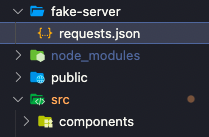
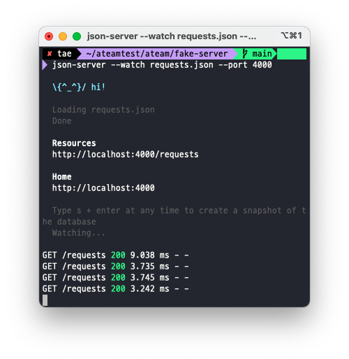

<br />

### 오늘한일 👨🏻‍💻 .
> 1. 면접준비 🔥
> 2. 코딩테스트 ⚙️

<br />

### 기록 ✍🏻 .

### 1. Introduction
  > json-server는 json 파일을 사용하여 간단한 시뮬레이션을 위한 REST API Mock server를 구축할 수 있는 툴이다.

### 2. Setup

1. json-server 설치

    npm을 이용하여 json-server를 로컬 설치한다.

    ```jsx
    npm install -g json-server
    ```

2. db.json 파일 생성
  
    프로젝트 루트에 fake-server폴더 생성 requests.json 파일을 생성한다. requests.json 파일은 데이터베이스 역할을 한다.<br />
    
    

    ```json
    예시) db.json
        {
          "todos": [
            {
              "id": 1,
              "content": "HTML",
              "completed": true
            },
            {
              "id": 2,
              "content": "CSS",
              "completed": false
            },
            {
              "id": 3,
              "content": "Javascript",
              "completed": true
            }
          ],
          "users": [
            {
              "id": 1,
              "name": "Lee",
              "role": "developer"
            },
            {
              "id": 2,
              "name": "Kim",
              "role": "designer"
            }
          ]
        }
    ```
3. json-server 실행
    
    json-server가 requests.json 파일을 watching하도록 실행한다.

    ```
    ## watch 옵션 적용
    $ json-server --watch requests.json
    ```
    기본 포트는 3000이다. 포트를 변경하려면 port 옵션을 추가한다.

    ## 포트 변경

    ```
    json-server --watch requests.json --port 4000
    ```

    

    ```http://localhost:4000/requests``` 접속해보면 json파일로 작성한 데이터를 확인 가능하다.

<br />

4. Postman을 사용하여 json-server에 접속하여 보자.

    참고 : https://poiemaweb.com/json-server

<br />

5. axios 설치하고 console.log로 확인해보기.


<br />
<br />
