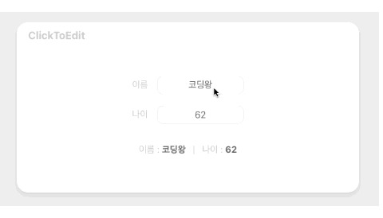
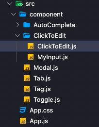

## ClickToEdit 만들기 🛠

웹서비스를 만들 때 자주 사용하게 되는 ClickToEdit 만들어 보자!! 프로젝트 구조는 다음과 같습니다. ClickToEdit 폴더 안에 ClickToEdit 컴포넌트와 Myinput 컴포넌트를 만들고 ClickToEdit 컴포넌트를 App.js에 불러와서 사용

<br />



<br />

### 1. Component 구조잡기 .

```jsx
ClickToEdit.js

  const cache = {
    name: "정종찬",
    age: 18,
  };
  const [name, setName] = useState(cache.name);
  const [age, setAge] = useState(cache.age);

<InputViewBox>
  <InputView>
    <label>이름</label>
    <MyInput
      value={name}
      handleValueChange={(newValue) => setName(newValue)}
    />
  </InputView>
    <InputView>
      <label>나이</label>
    <MyInput
      value={age}
      handleValueChange={(newValue) => setAge(newValue)}
    />
    </InputView>
    <InputView>
      <div className="view">
      <p>
        이름 : <span className="name_age">{name}</span> &nbsp; | &nbsp; 나이 : <span className="name_age">{age}</span>
      </p>
    </div>
  </InputView>
</InputViewBox>

```

```jsx
MyInput.js

const inputEl = useRef(null);
  const [isEditMode, setEditMode] = useState(false); //edit모드 상태
  const [newValue, setNewValue] = useState(value); //출력값 상태

  useEffect(() => {
    if (isEditMode) {
      //edit모드가 활성화 되면 input창에 포커스를 줘서 수정이 가능하도록 함
      inputEl.current.focus();
    }
  }, [isEditMode]);

  useEffect(() => {
    setNewValue(value);
  }, [value]);

  const handleClick = () => {
    //span태그를 클릭하면 edit모드가 활성화 되고 위의 useEffect에 의해 input창에 포커싱
    setEditMode(true);
  };

  const handleBlur = () => {
    //input창이 아닌 다른 곳을 클릭하면 edit모드를 비활성화로 만든다.
    setEditMode(false);
    handleValueChange(newValue); //그리고 input창에 입력되어있는 값으로 newValue를 변경
  };

  const handleInputChange = (e) => {
    setNewValue(e.target.value); //input에 입력한 값을 newValue에 담아둠
    //여기서 입력을 해준다고 바로바로 밑의 출력값이 변화 x
    //왜냐하면 handleBlur에 의해서 handleValueChange 함수가 실행되어야 값이 바뀌기 때문
  };

  return (
    <InputBox>
      {isEditMode ? (
        <InputEdit
          type="text"
          value={newValue}
          ref={inputEl}
          onBlur={handleBlur}
          onChange={handleInputChange}
        />
      ) : (
        <span onClick={handleClick}>{newValue}</span>
      )}
    </InputBox>
  );
```

### 2. Component 스타일링 .

```css
ClickToEdit.js

const InputViewBox = styled.div`
  display: flex;
  flex-direction: column;
  justify-content: center;
  align-items: center;
  height: auto;
  position: absolute;
`;

const InputView = styled.div`
  display: flex;
  justify-content: center;
  text-align: center;
  align-items: center;
  margin: 10px 0;

  label {
    color: #ccc;
  }

  div.view {
    color: #ccc;

    .name_age {
      font-weight: bold;
      color: #666;
    }
  }
`;

```

```css
MyInput.js

const InputBox = styled.div`
  width: 150px;
  height: 30px;
  display: flex;
  justify-content: center;
  align-items: center;
  border: 1px solid #efefef;
  border-radius: 10px;
  margin-left: 1rem;
  color: #666;
`;

const InputEdit = styled.input`
  width: 150px;
  height: 30px;
  display: flex;
  justify-content: center;
  align-items: center;
  text-align: center;
  display: inline-block;
  border: 1px solid #1da1f2;
  border-radius: 10px;
  color: #666;

  &:focus {
    outline: none;
  }
`;

```

<br />


### 구현 방법 .

> useState 훅을 이용하여 input의 상태를 관리하고, useRef 훅으로 input 창을 클릭한 상태에서만 값을 변경할 수 있게 하였습니다.

<br />

### 어려웠던 점 해결 방법 .

> input의 변경된 값을 저장하는 button이 따로 존재하지 않기 때문에 입력된 값을 변경하는 방법이 어려웠습니다. 해결 방법으로 input에 입력한 값을 newValue에 담은 뒤, handleBlur에 의해서 handleValueChange 함수가 실행되어 값이 바꿔 해결하였습니다.

```jsx
const [isEditMode, setEditMode] = useState(false);
const [newValue, setNewValue] = useState(value);
  
const handleBlur = () => {
    setEditMode(false);
    handleValueChange(newValue);
  };

  const handleInputChange = (e) => {
    setNewValue(e.target.value);
  };

  return (
    <InputBox>
      {isEditMode ? (
        <InputEdit
          type="text"
          value={newValue}
          ref={inputEl}
          onBlur={handleBlur}
          onChange={handleInputChange}
        />
      ) : (
        <span onClick={handleClick}>{newValue}</span>
      )}
    </InputBox>
  );
```

<br />

### 자세한 실행 방법 .

> 1. useState 훅을 이용하여 input의 상태를 관리하고, useRef 훅으로 input 창을 클릭한 상태에서만 값을 변경할 수 있게 하였습니다.<br />
> 2. myInput 컴포넌트를 만들어 input에 입력된 value 값을 핸들링하였고, label을 사용하여 input의 사용처를 사용자에게 전달합니다.<br />
> 3. handleClick 함수로 edit 모드가 활성화되며 input 창이 활성화되고, handleBlur 함수로 input 창이 아닌 다른 곳을 클릭하면 edit 모드를 비활성화됩니다.<br />
> 4. input에 입력한 값을 newValue에 담은 뒤, handleBlur에 의해서 handleValueChange 함수가 실행되어 값이 바뀌게 됩니다.<br />


<br />
<br />