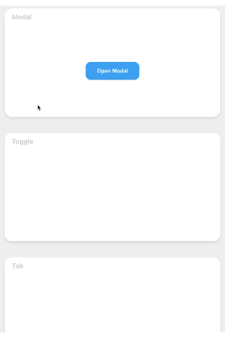
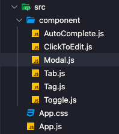

## Modal 만들기 🛠

웹서비스를 만들때 자주 사용하게 되는 모달(팝업)을 만들어 보자!! 프로젝트 구조는 다음과 같습니다. Modal 컴포넌트를 App.js에 불러와서 사용

<br />



<br />

### 1. Component 구조잡기 .

```jsx
Modal.js

// 모달 열기 & 닫기
  const [isOpen, setIsOpen] = useState(false);
  const ModalHandler = (event) => {
    if (isOpen) {
      // 배경 스크롤 방지 해제
      document.body.style.overflow = "unset";
      setIsOpen(!isOpen);
    } else {
      // 배경 스크롤 방지
      document.body.style.overflow = "hidden";
      setIsOpen(!isOpen);
    }
  };

  // esc로 닫기
  const keyPress = useCallback(
    (e) => {
      if (e.key === "Escape" && setIsOpen) {
        setIsOpen(!isOpen);
        document.body.style.overflow = "unset";
      }
    },
    [isOpen, setIsOpen]
  );

  useEffect(() => {
    document.addEventListener("keydown", keyPress);
    return () => document.removeEventListener("keydown", keyPress);
  }, [keyPress]);

<ModalBox>
  <ModalButton onClick={ModalHandler}>
    {isOpen ? "Hello 🎉" : "Open Modal"}
  </ModalButton>
  {isOpen ? (
    <ModalBackGround onClick={ModalHandler}>
      <ModalContents
        onClick={(event) => {
          event.stopPropagation();
        }}
      >
        <div className="close-btn" onClick={ModalHandler}>
          &times;
        </div>
        <div>Hi there 👋</div>
      </ModalContents>
    </ModalBackGround>
  ) : null}
</ModalBox>
```

### 2. Component 스타일링 .

```css
Modal.js

const ModalBox = styled.div`
  display: flex;
  justify-content: center;
  align-items: center;
  height: 100%;
  position: relative;
`;

const ModalBackGround = styled.div`
  position: fixed;
  display: flex;
  justify-content: center;
  align-items: center;
  width: 100%;
  height: 100%;
  top: 0;
  left: 0;
  right: 0;
  bottom: 0;
  margin: auto;
  background-color: rgba(0, 0, 0, 0.5);
  z-index: 1;

  // 모달 오픈시 백그라운드가 fade-in 효과로 등장하는 애니메이션
  animation: fadeInBg 0.25s ease-out;

  @keyframes fadeInBg {
    from {
      opacity: 0;
    }
    to {
      opacity: 1;
    }
  }
`;

const ModalButton = styled.button`
  width: 150px;
  height: 50px;
  font-size: 15px;
  font-weight: bold;
  color: #fff;
  border: none;
  border-radius: 15px;
  cursor: pointer;

  &:focus {
    outline: none;
  }

  &:hover {
    background-color: #1b92ce;
    transition: 0.25s;
  }

  &:not(hover) {
    background-color: #1da1f2;
    transition: 0.25s;
  }
`;

const ModalContents = styled.div`
  display: flex;
  flex-direction: column;
  justify-content: center;
  align-items: center;
  background-color: #fff;
  width: 250px;
  height: 150px;
  color: #1da1f2;
  font-size: 20px;
  font-weight: bold;
  border-radius: 15px;
  position: relative;

  // 모달 오픈시 위에서 아래로 fade-in 효과로 등장하는 애니메이션
  animation: fadeInModal 0.25s;

  @keyframes fadeInModal {
    from {
    opacity: 0;
    margin-top: -80px;
    }
    to {
      opacity: 1;
      margin-top: 0;
    }
  }
}

}

  > .close-btn {
    position: absolute;
    top: 8px;
    right: 15px;
    font-size: 22px;
    cursor: pointer;

    &:hover {
      color: #1DA1F2;
      transition: 0.25s;
    }
    &:not(hover) {
      color: #333;
      transition: 0.25s;
    }
  }
`;
```

<br />


### 구현 방법 .

> useState 훅을 이용하여 boolean 상태 값을 핸들링하는 ModalHandler 함수를 만들어 모달을 열거나 닫도록 하였습니다. 상태 값을 변수로 사용하면 모달이 오픈될 때 자동으로 Dom이 재 렌더링 되는 것을 방지하기 위해 useState를 사용하여 구현하였습니다.

<br />

### 어려웠던 점 해결 방법 .

> 모달을 구현한 뒤 모달 영역을 클릭해도 모달이 닫히는 현상이 있었습니다. 이유는 부모 컴포넌트에 이벤트가 핸들러가 걸려있을 때 자식 컴포넌트에도 같은 핸들러가 작동이 되기 때문이었습니다. 이를 방지하기 위해 stopPropagation 메서드를 사용하여 자식 요소인 `ModalContents 컴포넌트에 onClick={(event) => {event.stopPropagation()}를 적용`하여 문제를 해결했습니다. 결과로 모달 영역 밖을 클릭 시 모달이 닫히지만 모달 영역을 클릭 시 닫히지 않게 구현하였습니다.

<br />

### 자세한 실행 방법 .

> 1. useState 훅을 이용하여 boolean 상태 값을 핸들링하는 ModalHandler 함수를 만들어 모달을 열거나 닫을 수 있습니다. <br />
> 2. 오픈 된 모달 팝업의 부모 요소 뒷배경이 높아 스크롤이 생길 시 ovflow hidden을 사용하여 스크롤을 막아 모달 팝업에 포커스를 맞췄습니다. <br />
> 3. keyPress 함수에 useCallback으로 boolean 상태 값 핸들링을 재사용하고 useEffect를 사용하여 esc키로 모달을 닫을 수 있도록 편의성을 높였습니다. <br />
> 4. stopPropagation 메서드를 사용하여 오픈 된 모달 영역을 클릭 시에는 모달창이 닫히지 않지만 모달영역 이외의 공간 을 클릭시 모달을 닫을 수 있도록 편의성을 높였습니다.

<br />
<br />