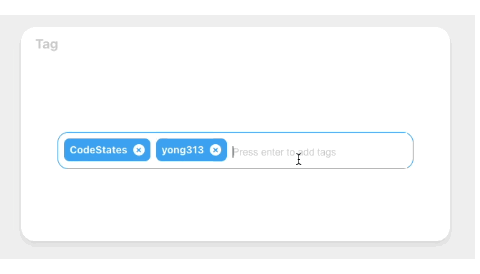
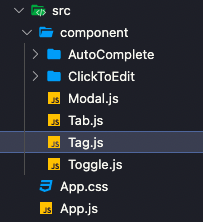

## Tag 만들기 🛠

웹서비스를 만들때 자주 사용하게 되는 Tag를 만들어 보자!! 프로젝트 구조는 다음과 같습니다. Tag 컴포넌트를 App.js에 불러와서 사용

<br />



<br />

### 1. Component 구조잡기 .

```jsx
Tag.js

const initialTags = ["CodeStates", "yong313"];

  const [tags, setTags] = useState(initialTags);

  const removeTags = (indexToRemove) => {
    // 삭제기능 구현
    // map함수의 index를 전달받아 클릭된 인덱스 정보를 활용해서 삭제를 시킴
    setTags(
      tags.filter((tag) => {
        return tag !== tags[indexToRemove];
      })
    );
  };

  const addTags = (event) => {
    //tag추가 기능 구현
    let value = event.target.value.trim();
    // 이미 입력되어 있는 태그인지 검사하여 이미 있는 태그라면 추가하지 말기
    // 아무것도 입력하지 않은 채 Enter 키 입력시 메소드 실행하지 말기
    if (event.key === "Enter" && !tags.includes(value) && value) {
      setTags([...tags, value]);
      // 태그가 추가되면 input 창 비우기
      event.target.value = "";
    } else if (event.key === "Enter" && !value) {
      event.target.value = "";
    }
  };

<TagsInput>
  <ul id="tags">
    {tags.map((tag, index) => (
      <li key={index} className="tag">
        <span className="tag_title">{tag}</span>
        <span
          className="tag_closeicon"
              onClick={() => removeTags(index)}
        >
          &times;
        </span>
      </li>
    ))}
  </ul>
  <input
     className="tag_input"
      type="text"
      onKeyUp={(event) => {
        addTags(event);
      }}
      placeholder="Press enter to add tags"
  />
</TagsInput>

```

### 2. Component 스타일링 .

```css
Tag.js

const TagsInput = styled.div`
  margin: 0 auto;
  display: flex;
  align-items: flex-start;
  flex-wrap: wrap;
  min-height: 48px;
  width: 480px;
  padding: 0 8px;
  border: 1px solid #efefef;
  border-radius: 15px;

  > ul {
    display: flex;
    flex-wrap: wrap;
    padding: 0;
    margin: 8px 0 0 0;

    > .tag {
      width: auto;
      height: 32px;
      display: flex;
      align-items: center;
      justify-content: center;
      color: #fff;
      font-weight: bold;
      padding: 0 8px;
      font-size: 14px;
      list-style: none;
      border-radius: 8px;
      margin: 0 8px 8px 0;
      background-color: #1da1f2;

      > .tag_closeicon {
        display: block;
        width: 16px;
        height: 16px;
        text-align: center;
        line-height: 14px;
        font-size: 13px;
        margin-left: 8px;
        color: #1da1f2;
        border-radius: 50%;
        background-color: #fff;
        cursor: pointer;
      }
    }
  }

  > .tag_input {
    flex: 1;
    border: none;
    height: 46px;
    font-size: 14px;
    padding: 4px 0 0 0;
    :focus {
      outline: transparent;
    }
    ::placeholder {
      color: #ccc;
    }
  }

  &:focus-within {
    border: 1px solid #1da1f2;
  }
`;
```

<br />


### 구현 방법 .

> useState 훅을 이용하여 tags의 상태를 관리하고, initialTags 함수로 기본 tag 값을 세팅하였습니다. 공백이 입력이 되지 않게 해주기 위해 trim() 함수 사용하였고, 이미 입력되어 있는 태그인지 검사하여 이미 있는 태그라면 추가하지 않기 위해 includes() 함수 사용하여 확인하였습니다. Enter 키를 활용하여, 태그를추가할 수 있도록 구현하였으며, map 함수의 index를 전달받아 클릭된 인덱스 정보를 활용해서 삭제하였습니다.

<br />

### 어려웠던 점 해결 방법 .

> 배열의 첫 번째 요소에 대한 인덱스를 반환하는 findIndex 함수를 사용하여 index를 찾아 삭제해 주는 방식을 사용하였지만, 비효율적이라 판단하여 주어진 함수의 테스트를 통과하는 모든 요소를 모아 새로운 배열로 반환하는 filter 함수를 사용하여 효율적을 로직을 구현하였습니다.

```jsx
const removeTags = (indexToRemove) => {
  setTags(
    tags.filter((tag) => {
      return tag !== tags[indexToRemove];
    })
  );
};
```

<br />

### 자세한 실행 방법 .

> 1. map 함수를 사용하여 tag를 생성하였습니다.<br />
> 2. Enter 키를 사용하여 tag를 추가할 수 있도록 onKeyUp 함수를 사용하였습니다.<br />
> 3. 공백 입력을 방지하기 위해 trim 함수를 사용하였습니다.<br />
> 4. 중복된 tag를 검사하여 추가를 막기 위해 includes 함수를 사용하였습니다.<br />
> 5. true 값만 반환하는 새로운 배열을 setTags에 넣고 filter() 함수를 사용하여 tag 삭제 기능을 구현하였습니다.

<br />
<br />