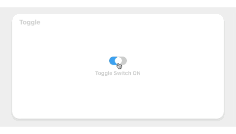
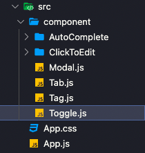

## Toggle 만들기 🛠

웹서비스를 만들때 자주 사용하게 되는 토글(스위치)을 만들어 보자!! 프로젝트 구조는 다음과 같습니다. Toggle 컴포넌트를 App.js에 불러와서 사용

<br />



<br />

### 1. Component 구조잡기 .

```jsx
Toggle.js

// 토글 상태 관리
const [isToggleOn, setIsToggleOn] = useState(false);
const toggleHandler = () => {
  setIsToggleOn(!isToggleOn);
};

<ToggleBox onClick={toggleHandler}>
  <div
    className={`toggle_bg ${isToggleOn ? "toggle_check" : ""}`}
  />
  <div className={`toggle_ball ${isToggleOn ? "toggle_check" : ""}`} />
</ToggleBox>
<ToggleState>
  <div>{isToggleOn ? "Toggle Switch ON" : "Toggle Switch OFF"}</div>
</ToggleState>

```

### 2. Component 스타일링 .

```css
Toggle.js

const ToggleBox = styled.div`
  position: absolute;
  top: 35%;
  left: 50%;
  transform: translate(-50%, -50%);
  cursor: pointer;

  > .toggle_bg {
    width: 50px;
    height: 24px;
    border-radius: 30px;
    background-position: right;
    background: linear-gradient(to left, #ccc 50%, #1da1f2 50%) right;
    background-size: 200%;
    transition: 0.45s;

    &.toggle_check {
      background-position: left;
      background: linear-gradient(to right, #1da1f2 50%, #ccc 50%) left;
      background-size: 200%;
      transition: 0.45s;
    }
  }

  > .toggle_ball {
    position: absolute;
    top: 2px;
    left: 2px;
    width: 20px;
    height: 20px;
    border-radius: 50%;
    background-color: #ffffff;
    transition: 0.35s;

    &.toggle_check {
      left: 27px;
      transition: 0.35s;
    }
  }
`;

const ToggleState = styled.div`
  display: flex;
  color: #ccc;
  font-size: 15px;
  font-weight: bold;
  justify-content: center;
  position: absolute;
  top: 45%;
`;
```

<br />


### 구현 방법 .

> useState 훅을 이용하여 boolean 상태 값을 핸들링하는 ToggleHandler 함수를 만들어 토글의 스위치를 켜거나 끄도록 하였습니다. 상태 값을 변수로 사용하면 토글의 스위치가 켜질때 자동으로 Dom이 재 렌더링 되는 것을 방지하기 위해 useState를 사용하여 구현하였습니다.

<br />

### 어려웠던 점 해결 방법 .

> 토글스위치가 켜질 때 뒷배경과 토글 버튼이 좌측에서 우측으로 이동되는 움직임을 만드는 게 어려웠습니다. linear-gradient를 사용하여 배경이 한쪽에서 부터 점점 채워지는 느낌으로 구현할 수 있었고, 토글 UI에서는 isToggleOn 상태를 활용해서 className을 변경해 주는 방식으로 css를 적용하여 토글스위치가 움직이는 것을 구현할 수 있었습니다.

```jsx
<ToggleBox onClick={toggleHandler}>
  <div className={`toggle_bg ${isToggleOn ? "toggle_check" : ""}`} />
  <div className={`toggle_ball ${isToggleOn ? "toggle_check" : ""}`} />
</ToggleBox>
```

```css
.toggle_bg {
    background-position: right;
    background: linear-gradient(to left, #ccc 50%, #1da1f2 50%) right;
    background-size: 200%;
    transition: 0.45s;

    &.toggle_check {
      background-position: left;
      background: linear-gradient(to right, #1da1f2 50%, #ccc 50%) left;
      background-size: 200%;
      transition: 0.45s;
    }
  }
```
<br />

### 자세한 실행 방법 .

> 1. useState 훅을 이용하여 boolean 상태 값을 핸들링하는 ToggleHandler 함수를 만들어 토글의 스위치를 켜거나 끄도록 하였습니다. <br />
> 2. 토글 UI에서는 isToggleOn 상태를 활용해서 className을 변경해 주는 방식으로 css를 적용하여 토글스위치가 움직이는 것을 구현할 수 있었습니다. <br />
> 3. 토글스위치 하단의 텍스트 또한 isToggleOn 상태를 활용해서 상태에 맞게 "Toggle Switch ON", "Toggle Switch OFF"출력 되도록 하였습니다.

<br />
<br />